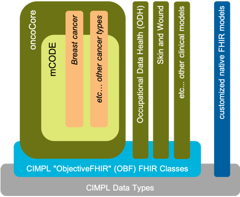
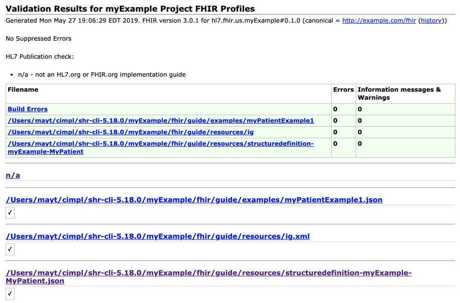

# CIMPL Authoring Guide

## Introduction

CIMPL (**C**linical **I**nformation **M**odeling **P**rofiling **L**anguage) is a specially-designed language for defining clinical information models. It is simple and compact, with tools to produce [HL7 Fast Healthcare Interoperability Resources (FHIR)](https://www.hl7.org/fhir/overview.html) profiles, extensions and implementation guides (IG). Because it is a _language_, written in text statements, CIMPL encourages distributed, team-based development using conventional source-code control tools such as Github. CIMPL provides tooling that enables you to define a model once, and publish that model as Implementation Guides to multiple versions of FHIR.

***

**Table Of Contents**

[TOC]

***

## Scope

This document provides a step-by-step guide to generate an HL7 FHIR implementation guide (IG) starting with documenting a model using CIMPL. 

The details about how to accomplish each step are in the [CIMPL Language Reference Guide](cimpl6LanguageReference.md) and [CIMPL Tooling Reference Guide](cimpl6LanguageReference.md). Links to these documents are provided in each section.

## Intended Audience

The CIMPL Authoring Guide is targeted to any person comfortable with using software developers or people comfortable with programming languages. Familiarity with FHIR is helpful as the tutorial references FHIR artifacts (such as Resources, Elements, etc.)

## Pre-requisite

This guide assumes you installed the software documented here: 

* [CIMPL SetUp and Installation](cimplInstall.md) 

and have at least reviewed the [Hello World](cimpl6Tutorial_helloWorld.md), and [CIMPL In-Depth](cimpl6TutorialDetail.md) tutorials. 

If you already have installed shr-cli, make sure you have the latest version installed. 

## Helpful Documentation

If you want to learn more about the commands and files referenced in this guide, refer to the [CIMPL Language Reference Guide](cimpl6LanguageReference.md) and [CIMPL Tooling Reference Guide](cimpl6LanguageReference.md).   

Links to these documents are provided throughout.

# Using CIMPL to Create FHIR-based Models

CIMPL is designed to be modular and extensible, allowing for the reuse of other logical models, and inheritence from those models. The figure below illustrates this notion.

Model key:

* Gray: CIMPL data types `Primitives` 
* Light blue: [ObjectiveFHIR (OBF)](cimpl6ObjectiveFHIR.md) models 
* Dark green: models created using CIMPL, leveraging OBF
* Light yellow: mCode model, _constrains_ and _extends_ oncoCore, leverages OBF
* Tan: models that _constrain_ and _extend_ mCode
* Dark blue: FHIR resources and profiles

CIMPL allows the modeling author to represent  FHIR profiles in one of two ways:

* **Define the model specific resource attributes you need using FHIR resources or profiles as a base (*clean slate*).** In this approach, the modeling author already knows the FHIR resources or profiles to customize, and defines the element constraints or extensions in the new FHIR profile.
* **Leverage CIMPL's _ObjectiveFHIR_ (OBF) base FHIR models** -  In this approach, the modeling author defines their FHIR profile and specifies a `Parent` class from the [ObjectiveFHIR User Guide](cimpl6ObjectiveFHIR.md) elements. 

Each modeling approach has advantages and disadvantages.

The CIMPL _clean slate_ authoring approach might be beneficial when prototyping models containing only a small number of new profiles with minimal changes from base FHIR.  However, as the number of customizations increases, maintenance becomes more cumbersome and difficult to keep consistent between FHIR profiles.

On the other hand, using OBF FHIR models has significant benefits which include but are not limited to:

* saves the modeling author time in mapping common elements to their equivalent FHIR attribute.
* ensures consistency in the representation of commonly used attributes in different FHIR resources.

The user must however invest time to understand the OBF logical model. Also, OBF does not comprehensively support all FHIR resources, especially the new ones in R4 with a low maturity level.

## Logical Model
Start by understanding the model you want to document in CIMPL, and its relationship to either base FHIR resources and profiles, or to OBF.

One approach is described in [Appendix A](#Appendix-A:-An-Approach-to-CIMPL-Modeling-for-FHIR).

## Model Folder Structure and Source Control
Create a folder/directory to contain all files you create for the model. All files should be governed by a source control system. 

[CIMPL In-Depth Tutorial](#cimpl6Tutorial_detail.md)

## Configuration File
A configuration file sets parameters to drive IG creation.

By declaring optional parameters, your IG may include model documentation, a graphical view of the model, examples, or a data dictionary. These sections are automatically generated, are not required to include in the IG, but provide valuable information to IG consumers.

[CIMPL Tooling Reference Guide](cimpl6ToolingReference.md)

## Namespace
Each model must define a namespace - this differentiates your model artifacts from others. 

[CIMPL Language Reference Guide](cimpl6LanguageReference.md)

## Class File

The Class file documents your model. 

Decide if you need to import any namespaces (e.g. OBF). 

Create your Class file with namespaces to import, and `Entry`, `Property`, `Abstract` and `Element` declarations. 

[CIMPL Language Reference Guide](cimpl6LanguageReference.md)

## Map File

Create a Map file if your model added properties beyond any inherited models. 

Map the model specific properties to either FHIR resource/profile elements, or OBF. 

[CIMPL Language Reference Guide](cimpl6LanguageReference.md)

## Value Set File

Create this file when you need to constrain an `Element Value` of `concept` in the Class file and there is not an existing value set to reference.  

To avoid redundant value sets, try to find an existing value set that fits your use case. 

[CIMPL Language Reference Guide](cimpl6LanguageReference.md)

## Content Profile File

Create a *Content Profile* file if there are properties in your model that are critical to IG compliance and _must_ be supported. Any inerited model properties that are not already defined as [_MustSupport_](https://www.hl7.org/fhir/conformance-rules.html) are listed in the same file.   

[CIMPL Tooling Reference Guide](cimpl6ToolingReference.md)

## Front Matter
Introductory text and possibly detailed text is required for IG readers and implementers to understand the background and intended use of your IG.

Create this information and declare the location in the Configuration file. 

Reviewing a [published IG](http://www.fhir.org/guides/registry/) might help you structure this material. 

[CIMPL Tooling Reference Guide](cimpl6ToolingReference.md)

## FHIR Examples 

A FHIR IG can be generated without examples, however it is recommended to include examples. 

The FHIR IG generation process requires that an examples folder/directory be defined in the Configuration file. The folder may be empty.   

[CIMPL Tooling Reference Guide](cimpl6ToolingReference.md)

## Compile the CIMPL Model
This step runs a syntax check on the Class, Map and Value Set files and prepares files for IG generation. 

Errors may be issued from this step. 

[CIMPL Language Reference Guide](cimpl6LanguageReference.md)

## Publish the FHIR IG

The final step in the IG creation process is to run the **[FHIR IG Publisher](http://wiki.hl7.org/index.php?title=IG_Publisher_Documentation)**. This tool is maintained and owned by HL7 FHIR.

By default, the FHIR IG Publisher performs validation checks on the  StructureDefinition of specified FHIR profiles, value sets, and examples which reference any base resources or FHIR profiles.  An output of these checks are found in the CIMPL output, *qa.html*.

An example QA output is shown in the figure below:

[CIMPL Language Reference Guide](cimpl6LanguageReference.md)

## Support

Questions on using CIMPL and its toolchain (SHR-CLI)can be addressed on the HL7 Zulip chat channel [#cimpl](https://chat.fhir.org/#streams/197290/cimpl)

If you find an issue you can't resolve, or have a question, report it on one of two JIRA projects:

* Related to running the CIMPL SHR-CLI compiler, configuration files, or generating the FHIR Implementation Guide (IG): https://standardhealthrecord.atlassian.net/projects/CIMPL/issues
* Related to CIMPL base classes (Objective FHIR): https://standardhealthrecord.atlassian.net/projects/SHRM/issues

# Appendix A: An Approach to CIMPL Modeling for FHIR

Keeping in mind that CIMPL is primarily a way to create logical models with the capability to _model-once, translate-to-many_, the modeling author should consider requirements-gathering and high level modeling steps.  While one approach is proposed below, the modeling author is not limited to following these steps and might find better approaches to creating detailed clinical models.

* Define the use cases behind the creation of a model.
* Create a high-level conceptual model which addresses your defined use case and can be easily understood by both technical and clinical communities.
* Create a data dictionary listing the data elements, cardinality, and potential value sets involved if the data type is a coded element. This provides a convenient summary for implmenters presented in a way that can be understood by non-technical subject matter experts involved in defining the use cases. 
* Start documenting your model with [CIMPL](#Model-Folder-Structure-and-Source-Control). 
