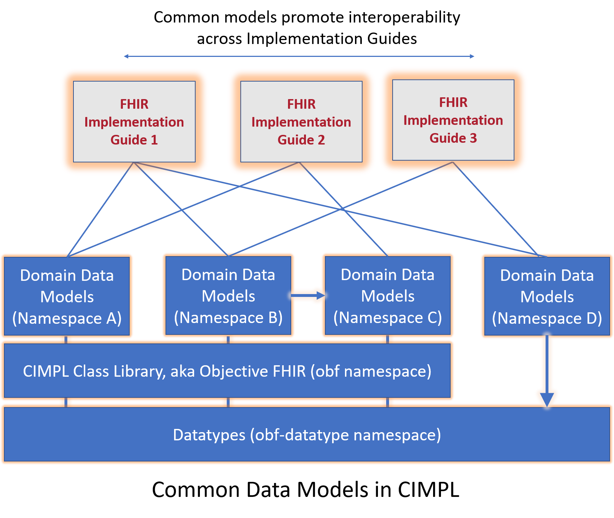

# CIMPL User Guide

>**Note**: This document is a work-in-progress. Updates to expand the content are on-going.

***

## Table of Contents

[TOC]

***

## Introduction

CIMPL (**C**linical **I**nformation **M**odeling **P**rofiling **L**anguage) is a specially-designed language for defining clinical information models. It is simple and compact, with tools to produce [Health Level Seven (HL7®) Fast Healthcare Interoperability Resources (FHIR®)](https://www.hl7.org/fhir/overview.html) profiles, extensions and [implementation guides](https://wiki.hl7.org/index.php?title=FHIR_Implementation_Guides) (IG). Because it is a _language_, written in text statements, CIMPL encourages distributed, team-based development using conventional source-code control tools such as Github. CIMPL provides tooling that enables you to define a model once, and publish that model to multiple versions of FHIR.

> **NOTE**: HL7® and FHIR® are registered trademarks owned by Health Level Seven International, and are registered with the United States Patent and Trademark Office.

### Purpose

This document provides a step-by-step guide to generate an HL7 FHIR IG starting with using CIMPL to document a model. The details about how to accomplish each step are in the [CIMPL Language Reference Manual](cimpl6LanguageReference.md) and [CIMPL Tooling Reference Manuals](cimpl6ToolingReference.md). Links to specific sections of these documents are provided in each section.

### Intended Audience

The CIMPL User Guide is targeted to any person comfortable with using programming languages. Familiarity with FHIR is helpful as the guide references FHIR artifacts (e.g. resources and profiles).

### Prerequisite

This guide assumes you installed the software as documented in [CIMPL Setup and Installation](cimplInstall.md), and have at least reviewed the [Hello World](cimpl6Tutorial_helloWorld.md), and [CIMPL In-Depth](cimpl6Tutorial_detail.md) tutorials. If you already have installed SHR-CLI, make sure you have the latest version installed.

## Using CIMPL to Create FHIR-based Models

CIMPL is designed to be modular and extensible, allowing for the reuse of other logical models, and inheritance from those models. The figure below illustrates this notion.

<!--  -->

CIMPL allows the modeling author to represent FHIR profiles in one of two ways:

* Define the model specific classes you need using HL7 HIR resources or profiles as a base (_clean slate_). In this approach, the modeling author already knows the FHIR resources or profiles to customize, and defines the element constraints or extensions in the FHIR profile to be created by the new model.
* Leverage CIMPL's _OBF_ FHIR models. In this approach, the modeling author defines their FHIR profile and specifies a `Parent` class from [OBF User Guide](cimpl6ObjectiveFHIR.md).

Each modeling approach has advantages and disadvantages.

The _clean slate_ authoring approach might be beneficial when prototyping models containing only a small number of new profiles with minimal changes from base FHIR. However, as the number of customizations increases, maintenance may become more cumbersome and difficult.

On the other hand, using OBF FHIR models has significant benefits which include but are not limited to:

* saving the modeling author time in mapping common `Element`s to the equivalent FHIR element,
* ensuring consistency in the representation of commonly used elements in different FHIR resources.

The user must however invest time to understand the OBF logical model. Also, OBF does not comprehensively support all FHIR resources, especially the ones introduced in FHIR R4 with a low maturity level.

## Logical Model

Start by understanding the model you want to document in CIMPL, and its relationship to either base FHIR resources and profiles, to OBF, or to a combination.

Keeping in mind that CIMPL is primarily a way to create logical models with the capability to _model-once, translate-to-many_, the modeling author should consider requirements gathering and high level modeling steps.  While one approach is proposed below, the modeling author is not limited to following these steps and might find better approaches to creating detailed clinical models.

* Define the use cases behind the creation of a model.
* Create a high-level conceptual model to address your use case that can be easily understood by both technical and clinical communities.
* Create a data dictionary listing the data elements, cardinality, and potential value sets involved if the data type is a coded element. This provides a convenient summary for implementers presented in a way that can be understood by non-technical subject matter experts.
* Start documenting your model with CIMPL.

## Model Folder Structure and Source Control

Create a folder/directory to contain all files you create for the model. If you are modeling with a distributed team, you should consider using a source control system for your CIMPL files.

[Suggested Directory Structure](cimpl6ToolingReference.md#suggested-directory-structure)

## Configuration File

A Configuration file sets parameters to drive IG creation.

By declaring optional parameters, your IG may include model documentation, a graphical view of the model, examples, and a data dictionary. These sections are automatically generated, are not required to include in the IG, but provide valuable information to IG consumers.

The data dictionary export might require manual adjustments before the IG is published. Review this document to make sure the data dictionary export meets your needs.

[Configuration File Details](cimpl6ToolingReference.md#configuration-file)

## Namespace

Each model _must_ define a namespace - this differentiates your model artifacts from those in another namespace.

[Namespace Guidance](cimpl6LanguageReference.md#namespaces)

## Class File

The Class file documents your model.

Decide if you need to import any namespaces (e.g. OBF).

Create your Class file with namespaces to import, and `Entry`, `Property`, `Abstract` and `Element` declarations.

[Learn how to create a Class file](cimpl6LanguageReference.md#class-file)

## Map File

Create a Map file if your model includes `Property` declarations beyond any inherited models, and you want to map the `Property` to a FHIR element.

> Note: A Map file is necessary if OBF is _not_ used. If OBF _is_ used, a Map file may not be necessary.

[Learn how to create a Map file](cimpl6LanguageReference.md#map-file)

## Value Set File

Create a ValueSet file when you need to constrain an `Element` with data type `concept` in the Class file, and there is not an existing value set to reference.  

To avoid redundant value sets, try to find an existing value set that fits your use case rather than creating a custom, IG specific value set.

[Learn how to create a Value Set file](cimpl6LanguageReference.md#value-set-file)

## Content Profile File

Create a Content Profile file if there are properties in your model that are critical to IG compliance and _must_ be supported. Any inherited model properties that are not already defined as [**MustSupport**](https://www.hl7.org/fhir/conformance-rules.html) are listed in the same file.

A list of classes _not_ to be profiled, designated with the [No-Profile](#specifying-no-profile-elements) `NP` tag.

[Learn how to create a Content Profile file](cimpl6ToolingReference.md#content-profile-file)

## Front Matter

Introductory text is required, and detailed text is optional for IG readers and implementers to understand the background and intended use of your IG.

Create this information and declare the location in the Configuration file.

Reviewing a [published IG](http://www.fhir.org/guides/registry/) might help you structure this material.

[Front Matter Guidance](cimpl6ToolingReference.md#front-matter-files)

## FHIR Examples

A FHIR IG can be generated without examples, however it is recommended to include examples.

The location of the examples is declared in the Configuration file.

[Learn how to create FHIR Examples](cimpl6ToolingReference.md#fhir-examples)

## Compile the CIMPL Model

This step runs a syntax check on the Class, Map and ValueSet files and prepares files for IG generation.

Errors may be issued from this step.  

[Compile your model](cimpl6ToolingReference.md#executing-shr-cli)

## Publish the FHIR IG

The final step in the IG creation process is to run the **[HL7 FHIR IG Publisher](http://wiki.hl7.org/index.php?title=IG_Publisher_Documentation)**. This tool is maintained and owned by HL7.

By default, the HL7 FHIR IG Publisher performs validation checks on the **StructureDefinition** of specified FHIR profile, **value sets**, and **examples** which reference any FHIR resources or profile.  Output of these checks are found in the CIMPL output, _qa.html_.

[Run the HL7 FHIR publisher and create an IG](cimpl6ToolingReference.md#creating-the-implementation-guide)

## Support

Questions on using CIMPL and its toolchain (SHR-CLI) can be addressed on the HL7 Zulip chat channel [#cimpl](https://chat.fhir.org/#streams/197290/cimpl)

If you find an issue you can't resolve, or have a question, report it on one of two JIRA projects:

* Issues related to running the CIMPL SHR-CLI compiler, configuration files, or generating the FHIR IG: https://standardhealthrecord.atlassian.net/projects/CIMPL/issues
* Issues related to CIMPL base classes (OBF): https://standardhealthrecord.atlassian.net/projects/SHRM/issues

# Appendix - Document Conventions

| Style | Explanation | Example |
|:----------|:---------|:---------|
| **Bold**  | An FHIR resource name or reserved word | **Observation** **MustSupport** |
| `Code` | A CIMPL term, phrase, example, or command | `CodeSystem: LNC = http://loinc.org` |
| <code><i>Italics</i> appearing in a code block | Indicates an item that should be substituted | <code>Value only <i>datatype</i></code> |
| _Italics_ | A file name, or general emphasis in text | _obf-action.txt_ |
| _Italics with **bold** highlight_ | Indicates a substring in the file name that should be substituted | _ig-**myigname**-config.json_ |
| Leading Capitalization | CIMPL keywords or references that are capitalized; specific instances of FHIR artifacts | The `Grammar` keyword |
| **Note:** | Something to keep in mind about the current topic | **Note:** Value Set names must begin with an uppercase letter. |
