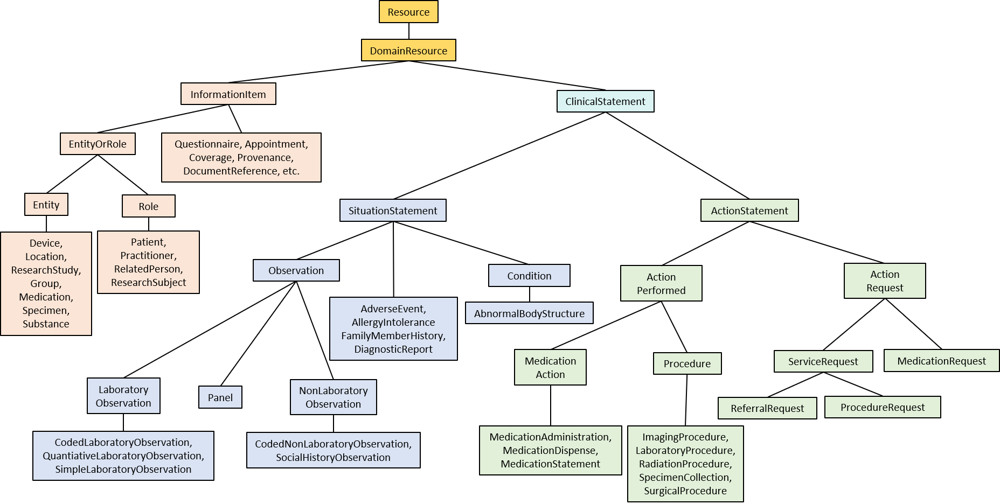

# CIMPL Class Library (aka Objective FHIR)

***

## Table of Contents

[TOC]

***

## Introduction

CIMPL (**C**linical **I**nformation **M**odeling **P**rofiling **L**anguage) is a specially-designed language for defining clinical information models. It is simple and compact, with tools to produce [Health Level Seven (HL7®) Fast Healthcare Interoperability Resources (FHIR®)](https://www.hl7.org/fhir/overview.html) profiles, extensions and implementation guides (IG). Because it is a _language_, written in text statements, CIMPL encourages distributed, team-based development using conventional source code control tools such as Github. CIMPL provides tooling that enables you to define a model once, and publish that model to multiple versions of HL7 FHIR.

> **Note**: HL7® and FHIR® are registered trademarks owned by Health Level Seven International, and are registered with the United States Patent and Trademark Office.

### Purpose

This document presents an overview of the CIMPL class library (also known as Objective FHIR (OBF)),  a set of pre-mapped data types and classes that can be used as the basis for a clinical model. Use of OBF with CIMPL is optional, but [recommended](#overview).

### Intended Audience

The CIMPL Class Library Guide is targeted to modelers with some familiarity with CIMPL and FHIR. Experience with object-oriented modeling, and concepts such as class inheritance is assumed.

### Prerequisite

This guide assumes you have:

* Installed the latest version of the SHR-CLI software as documented in [CIMPL Setup and Installation](cimplInstall.md) (preferably installed in the `~/cimpl/shr-cli` directory)
* A text editor (preferably VSCode with the _vs-code-language-cimpl_ extension, but not required)
* Reviewed the [Hello World Tutorial](cimpl6Tutorial_helloWorld.md).

## Overview

OBF is an [object-oriented](https://en.wikipedia.org/wiki/Object-oriented_programming) abstraction of FHIR. Modelers may take advantage of OBF in CIMPL to define a detailed clinical information model by subclassing, extending, and constraining a pre-existing class library. These classes can then be translated automatically into FHIR profiles, FHIR IGs, data dictionaries, schemas, and other assets, using a choice of the three major FHIR versions: DSTU 2, STU 3, and R4.

OBF serves as the base class library for CIMPL. Use of OBF with CIMPL is optional, but recommended. The _clean slate_ approach to CIMPL models may be appropriate for some projects. [_Clean slate_](cimpl6Authoring.md#Using-CIMPL-to-Create-FHIR-based-Models) CIMPL models reference FHIR resources directly, without taking advantage of OBF.

### Philosophy

OBF classes resemble FHIR R4, but differ in carefully considered ways that increase consistency and reusability of the resulting models and profiles. OBF allows data structures of all sorts to be reused. This means that individual data elements and frequently-occurring structures can be defined once and used repeatedly.

OBF addresses one of the most frequent criticisms of FHIR, namely, its [lack of consistency](https://wolandscat.net/2019/05/05/a-fhir-experience-consistently-inconsistent/). FHIR not only uses different _names_ for equivalent things in different resources, but sometimes, entirely different modeling approaches. This is the result of having resources managed by separate HL7 work groups. OBF creates a layer that smooths over many of these differences, not for aesthetic or theoretical reasons, but to make the framework easier to learn, enable greater code reuse, and most importantly, to make the resulting clinical models _more interoperable_.

OBF also insulates modelers from differences between FHIR versions. The OBF classes are based on FHIR R4, but the same content is mapped to DSTU 2 and STU 3. This means you can model once and publish the same content across multiple FHIR versions.

### Meta-Model

OBF has been developed using CIMPL. CIMPL is a powerful, FHIR-aware, high-level language for creating clinical models. Expressing the model in CIMPL means that OBF models can be automatically turned into FHIR profiles, IGs, data dictionaries, and other useful artifacts, across multiple FHIR versions.

Conceptually, nothing prevents the same model from being expressed in other formalisms, some of which are mentioned in the [Appendix](#Appendix:-Relationship-to-Other-Initiatives). However, OBF with CIMPL is a complete, proven, ready-made solution that has created rich FHIR content, such as the [mCODE Implementation Guide](http://build.fhir.org/ig/HL7/fhir-mCODE-ig/branches/master/index.html).

### Mapping to FHIR

One of the significant benefits of the OBF framework, compared with _clean slate_, is that mapping to FHIR has already been done for you. In most cases, any model you create will be mapped to FHIR without additional effort. The only exceptions are when you create a new class that doesn't inherit from a pre-mapped OBF class, override a previous mapping , or add an extension to a pre-mapped class that requires mapping to a nested extension.

### Coverage

Not all FHIR R4 resources are covered by OBF. The [model documentation](http://standardhealthrecord.org/guides/obf/modeldoc.html) is the best source to determine if OBF covers your needs. If you need additional class coverage for your project, please [contact the project team](about.md).

### Subclassing

Suppose you want a more specific concept of `OccurrenceTimeOrPeriod` applied to a **SurgicalProcedure**. In this case, we can subclass:

```
Element:  SurgicalProcedureOccurrencePeriod
Parent:  OccurrenceTimeOrPeriod
Description: The period of time for a surgery, from the first incision time to the last incision close time, as defined by https://manual.jointcommission.org/releases/archive/TJC2010B/DataElem0127.html.
```

The structure and content of `OccurrenceTimeOrPeriod` is inherited by the new class (cardinalities, data type, the fact that the start time must be less than the end time, etc.), so repeating that information is unnecessary. [Don't repeat yourself (DRY)](https://en.wikipedia.org/wiki/Don%27t_repeat_yourself) is a major benefit of inheritance. The DRY principle is stated as "Every piece of knowledge must have a single, unambiguous, authoritative representation within a system."

### Subclassing, Part 2

The previous example is simple, but almost everything you do in OBF will involve creating new classes from existing ones. Here's a more involved example:

```
Entry:             GenomicsReport
Parent:            DiagnosticReport
Description:       "Genetic analysis summary report. The report may include one or more tests, with two distinct test types... (truncated)"
Property:          SpecimenType 0..1
Property:          RegionStudied 0..*
                   Code from https://www.ncbi.nlm.nih.gov/gtr (preferred)
                   Category 1..1
                   Category = DS#GE "Genetics"
                   Observation
                      includes GeneticVariantFound 0..* 
                      includes GeneticVariantTested 0..*
                   SpecimenType from GeneticSpecimenTypeVS (extensible)
```

* The first two lines create the class `GenomicsReport`, based on OBF class `DiagnosticReport`. `Entry` is a CIMPL building block that roughly corresponds to a FHIR resource, and `Parent` identifies the parent class.
* Following the `Description`, two new properties (with cardinalities) are introduced: `SpecimenType` and `RegionStudied`. Extensions will be generated automatically when the class is mapped to FHIR.

After the keyword section, there is a series of constraint statements.

* The code identifying the report should preferably come from the [Genetic Test Registry](https://www.ncbi.nlm.nih.gov/gtr).
* `Category` will occur once, and will be fixed to the code `GE` (Genetics) drawn from a code system aliased to `DS` (mapped elsewhere to <http://terminology.hl7.org/CodeSystem/v2-0074>).
* The `Observation` attribute should include zero or more `GeneticVariantFound` observations and zero or more `GeneticVariantTested` observations. The `includes` statement is used to slice arrays.
* Finally, the `SpecimenType`, (new property), is bound to the value set `GeneticSpecimenTypeVS` with an extensible strength.

We have created a general-purpose `GenomicsReport` class. We can use this class in the form of a FHIR profile, or use it as a parent for defining more specific genomics reports, perhaps `AncestryDotComGenomicsReport`.

### Comparison Between Profiling Tools

In FHIR terms, subclassing is akin to profiling profiles, which can be achieved in a number of tools, notably [Forge](https://fire.ly/products/forge/) and [Trifolia](https://trifolia-fhir.lantanagroup.com/home). Both tools are well-done, and supported by commercial entities.

Forge and Trifolia are graphical user interfaces on top of structure definitions, the low-level _assembly language_ of FHIR. By contrast, CIMPL is a high-level programming language. Experience has shown that creating and maintaining a complex project is _much_ easier when you use a language, compared to a visual editor. That's why programming languages are almost always text-based, while visual programming has had comparatively little uptake. Even [Unified Modeling Language (UML)](https://www.uml.org/) - a model-diagramming standard that has been around for decades - is fraught with [portability problems](https://www.researchgate.net/publication/322557945_Solving_the_interoperability_problem_between_UML_modeling_tools_Modelio_and_ArgoUML), despite having its own exchange format, [XMI](https://en.wikipedia.org/wiki/XML_Metadata_Interchange). As [stated by Thomas Beale](https://wolandscat.net/2019/03/07/the-long-slow-death-of-uml/), "Architects these days tend to limit their use of UML to package diagrams and a few illustrative class diagrams, while _developers tend to go straight to code_ or use tools that pretty-print extracted textual forms of software such as swagger and apiary." (emphasis added). CIMPL takes the latter approach, producing a variety of explanatory and implementable assets generated from CIMPL code, rather than vice versa.

When clinical modeling projects grow to a certain size, activities increasingly revolve around repeatedly revisiting, revising, refactoring, and renaming. As a text language, CIMPL allows you to do global search and replace, which will become your new [BFF](https://en.wikipedia.org/wiki/Best_friends_forever). Using text also enables meaningful source code control. CIMPL files can be hosted in Github, which gives model developers the ability distribute work across multiple branches, compare changes (with meaningful diffs), and automatically merge contributions, allowing projects to scale in ways that visual editors can't support.

## Key Concepts

### Data Types

The primitive data types used in OBF are [those defined in CIMPL](cimpl6LanguageReference.md#primitives), which correspond one-to-one with FHIR primitives, except for [the way CIMPL handles coded types](cimpl6LanguageReference.md#concept-codes).

Complex data types in OBF are also the same as FHIR R4. They are found in the `obf.datatype` namespace. Since complex types like **Quantity** are ubiquitous, you will almost certainly need to import the `obf.datatype` into your namespace. This is done using the `Uses` keyword.

### Naming

Attribute names in OBF may differ from FHIR names. When they do so, it is usually to make the meaning of the attribute more explicit. OBF names are meant to be meaningful outside of the context of a single class.

For example, the FHIR attribute **Encounter.period** is not entirely self-explanatory, especially when **period** is considered alone, outside of the context provided by **Encounter**. To be more reusable, OBF uses the name `OccurrenceTimeOrPeriod`. Coupled with a different event, such as a procedure, the renamed attribute's meaning is more clear. Although an attribute name is rarely a sufficient definition, OBF moves the needle in that direction.

### OBF Actors

| Name | Description |
|------|---------|
| `SubjectOfRecord` | Identifies the person whose clinical record contains the information. The `SubjectOfRecord` is often the same as the patient or subject, but in some cases, the subject of information (called the `FocalSubject`) may be different than the SubjectOfRecord. |
| `InformationSource` | The originator or source of the information or request: a practitioner, patient, related person, organization, algorithm, device, etc. |
| `Author` | The actor who created the item and is responsible for the content (regardless of the information source or who recorded it). If only the `Author` is valued, it is assumed the `Author` is the information source and the recorder. |
| `FocalSubject` | The person or entity that the information in this resource relates to, if different than the `SubjectOfRecord`. |
| `Participant` | An actor (usually a practitioner, patient, or organization but potentially a device or other entity) that participates in a healthcare task or activity. The participant is not necessarily the performer of the action. |
| `Performer` | The actor that carried out the observation or action. |

> **Note:** OBF doesn't include the information recorder among the key actors. The recorder is the actor who physically enters the information, as opposed to creating or being responsible for the information. `Author` is occasionally mapped to a FHIR attribute named **recorder** when it is apparent that the resource designers assumed the author and recorder are the same.

### OBF Event Times

| Name | Description |
|-------|---------|
| `CreationDateTime` | The point in time when an ancillary item (such as a report or image) was created. |
| `OccurrenceTimeOrPeriod` | The time or period when the event occurred. |
| `StatementDateTime` | The time when the documentation of an event, action, or situation was created. |
| `RelevantTime` | The time or time period that the statement addresses, not necessarily when the information is gathered. |
| `LastUpdated` | The last time a record was updated. |

### Building Blocks

OBF classes fall into one of four categories, which are the building blocks of CIMPL:

| Building Block | Description | Inherits from |Analogous FHIR Type |
|----------|---------|---------|---------|
| `Element` | The lowest-level building block, representing a property-value pair. | `Element` | `Property` or simple extension |
| `Group` | A building block comprised of other building blocks, specifically, other `Group`, `Element`, and `Entry`. | `Group` | Backbone element or complex extension |
| `Entry`  | A building block representing a group of related information, complete enough to support stand-alone interpretation. | `Entry` or abstract | resource or profile |
| `Abstract` | A special type of `Entry` that cannot be instantiated, and will not be present in the target mapping. | `Abstract` | none |

## Class Hierarchy

In this section, we describe the organization and some key classes in OBF. A pared-down view of the OBF hierarchy is shown below. For full details of each class, please refer to the [OBF Reference Model Specification](http://standardhealthrecord.org/guides/obf/modeldoc.html).



The purpose of the hierarchy is two-fold:

1. To define properties uniformly across multiple classes. For example, almost every FHIR resource should have an `Author`, but [many don't, and those that do, use different names](https://lightmyfhir.org/2019/05/03/fhir-inconsistency-data-please/). It shouldn't be left up to individual resources, managed by different work groups, to define their own versions of `Author`. Inevitably, they will define it differently, or forget entirely, as FHIR R4 shows. Inheriting from a common parent prevents that.
2. To provide a set of ready-made classes that users can extend. An example is `QuantitativeLaboratoryObservation`, based on `Observation`.

FHIR's approach to uniformity is to define certain patterns, such as the [request pattern](https://www.hl7.org/fhir/request.html). FHIR stops short of actually implementing these patterns across resources. Implementations can't assume all requests have the same core properties, and can't write generic methods for processing requests. Instead, each type of request must be implemented individually.

### Resource, Domain Resource, Metadata

At the top of the OBF hierarchy are the classes `Resource` and `DomainResource`. They involve the `Metadata` group. These classes align with FHIR.

### Information Item

`InformationItem` includes definitional items, value set definitions, `Questionnaire`, `Appointment`, entities such as `Location`, `Organization`, `Specimen`, etc. While `InformationItem` has no attributes itself, it serves as a conceptual grouper for things that exist in the clinical world that are not statements about a patient's health or healthcare.

#### EntityOrRole

This branch of the hierarchy, splits into `Entity` and `Role`, and represents the potential actors in healthcare scenarios.

* Entities include `Location`, `Device`, `Medication`, and other physical or conceptual _things_.
* Roles are `Patient`, `Practitioner`, `RelatedPerson`, and `ResearchSubject`. FHIR models role resources by conflating the role with the person playing the role. Although this is not the optimal model, OBF continues that practice, to make OBF more obvious to FHIR users.

### Clinical Statement

`ClinicalStatement` provides properties and behaviors common to entries in a medical record. This class also allows for common representation of simple **Provenance** elements: `SubjectOfRecord`, `CareContext`, (`Encounter` or `EpisodeOfCare`), and `StatementDateTime`.

Below `ClinicalStatement` are two classes, `SituationStatement` and `ActionStatement`:

* `SituationStatement` covers many types of descriptive information, including `Observation`, `AdverseEvent`, `LaboratoryObservation`, and `SocialHistoryObservation`. 
* `ActionStatement` covers `ActionRequest` and `ActionPerformed` such as medication prescriptions and administrations, performed procedures and service requests.

## Future

Current work is focused on using the classes defined in OBF directly in implementations, leveraging automatically generated Javascript classes and methods that at runtime, translate FHIR resources to and from the logical model classes. This allows implementers to use object oriented programming in much more powerful ways than available in native FHIR, with its flat class structure and complex extension representations.

## Appendix: Relationship to Other Initiatives

Conceptually, the models in OBF could be expressed in modeling frameworks other than CIMPL. Some of the potential frameworks include:

* [Unified Modeling Language (UML)](https://www.uml.org/) for structure coupled with [Object Constraint Language](https://www.omg.org/spec/OCL) (OCL) for constraint representation. The [Federal Health Information Model initiative](https://www.fhims.org/) (FHIM) has conducted some experiments using [Model-Driven Health Tools](https://projects.eclipse.org/proposals/model-driven-health-tools) to try and convert UML/OCL models into FHIR profiles.
* [Basic Meta-Model](https://specifications.openehr.org/releases/LANG/latest/bmm.html) (BMM) for class hierarchy, coupled with [Archetype Description Language](https://specifications.openehr.org/releases/AM/latest/ADL2.html) (ADL) for constraint representation. BMM/ADL has been used in [openEHR](https://www.openehr.org/). [Claude Nanjo of University of Utah](https://faculty.utah.edu/u6017542-Claude_Nanjo/contact/index.hml) has conducted some experiments to try to convert ADL/BMM models into FHIR profiles.
* [Clinical Element Models](http://www.clinicalelement.com/#/). CEMs are being used to produce some [Clinical Information Modeling Initiative (CIMI) FHIR Implementation Guides](http://models.opencimi.org/ig/). Essential parts of CEM-related tooling are internal to Intermountain Healthcare.

OBF is an [open source project](https://github.com/standardhealth/shr-models), and we welcome contributions.

# Appendix: Document Conventions

| Style | Explanation | Example |
|:----------|:---------|:---------|
| **Bold**  | a FHIR reserved word or resource name | **Condition** |
| `Code` | A CIMPL term, phrase, example, or command | `CodeSystem: LNC = http://loinc.org` |
| <code><i>Italics</i> appearing in a code block | Indicates an item that should be substituted | <code>Value only <i>data type</i></code> |
| _Italics_ | A file name, or general emphasis in text | _obf-action.txt_ |
| _Italics with **bold** highlight_ | Indicates a substring in the file name that should be substituted | _ig-**myigname**-config.json_ |
| Leading Capitalization | CIMPL keywords or references that are capitalized; specific instances of FHIR artifacts | The `Grammar` keyword |
| **Note:** | Something to keep in mind about the current topic | **Note:** Value Set names must begin with an uppercase letter. |
