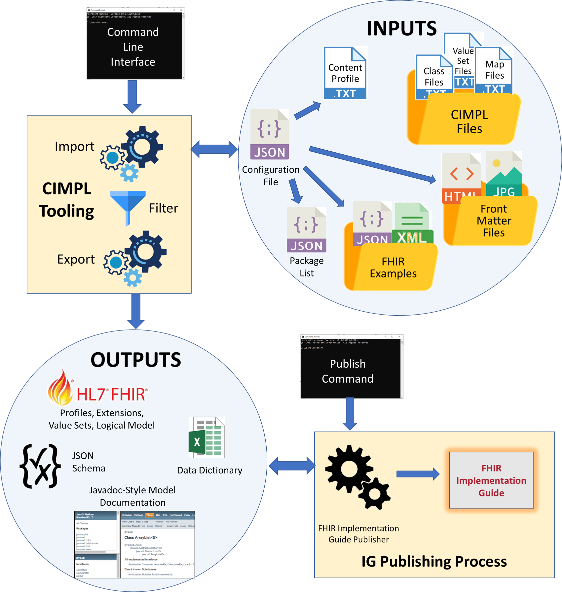

# CIMPL 6.0 Tooling Reference

>**Note:** This documentation is a draft.

_This is a comprehensive guide to CIMPL 6.0 Tooling, including the command line interface, auxiliary files, and configurations needed to produce a FHIR Implementation Guide (IG). If you're looking for a quick introduction to CIMPL and `SHR-CLI` environment setup, try the [Hello World](cimpl6Tutorial_helloWorld.md) or [In-Depth Tutorials](cimpl6Tutorial_detail.md). For details of the CIMPL language itself, see the [CIMPL Language Reference Manual](cimpl6LanguageReference.md)._

***

**Table of Contents**
[TOC]

***

## Overview

CIMPL (**C**linical **I**nformation **M**odeling **P**rofiling **L**anguage) is a specially-designed language for defining clinical information models. It is simple and compact, with tools to produce [Fast Healthcare Interoperability Resources (FHIR)](https://www.hl7.org/fhir/overview.html) profiles, extensions and Implementation Guides (IGs). The CIMPL language itself, however, does not completely define an IG. This reference manual describes the configurations, files, and commands needed to create a FHIR IG from CIMPL language files.

The CIMPL Tooling, also called SHR-CLI (Standard Health Record Command Line Interface), is the engine that reads processes CIMPL inputs and produces FHIR and other outputs, as shown below:

The inputs to this process include:

* **CIMPL Language files**, including class files, value set files, and mapping files that define your clinical information model,
* A **Configuration file** that contains directives to the tooling, and points to other resources,
* An optional **Content Profile** file, which specifies Must-Support elements and profiling options specific to an IG,
* One or more **Front Matter** files, which are the narratives and graphics that introduce the IG,
* **FHIR Examples** that are to be included in the IG, and
* A **Package List** that has information required for building the IG.

Depending on the configuration, the outputs of the CIMPL Tooling may include:

* **FHIR Profiles, Extensions, Value Sets** that form the core content of the IG,
* A **Logical Model** corresponding to the CIMPL class definitions, expressed as FHIR StructureDefinitions,
* **JSON Schema** for the profiles defined by the IG,
* A **Data Dictionary** that lists the Must-Support data elements in the IG, as well as value sets and value set members,
* **Model Documentation** in the form of a Javadoc-like browser that allows one to see the hierarchical class relationships in the logical model.

In the following, we describe these inputs and outputs, and the process of running the CIMPl tooling, to produce a FHIR Implementation Guide.

This reference manual assumes that the CIMPL Language files (classes, value sets, and maps) have been defined (see [CIMPL Language Reference Manual](cimpl6LanguageReference.md) for details). It also assumes that the CIMPL SHR-CLI tooling has been installed according to the directions in the [Setup and Installation Guide](cimplInstall.md).

## Directory Structure
The SHR-CLI tooling does not require a particular directory structure. However, following conventions makes the process of managing the requisite files much easier. 

* **Tooling Directory** - this the directory where the SHR-CLI tooling has been installed. Any convenient directory can be used
* **Specification Directory** - this is the directory where the input files are located. Any convenient directory can be used. If you are using Github to manage your build, this could be where the repository is checked out to your local machine.
* **

## Configuration File

SHR-CLI requires a configuration file to run. The name of this file (including the path if the file is not in the working directory) is typically specified on the command line using the -c command line option. If the name is not specified, the tooling looks for a file named `config.json` in the working directory If it cannot be found, or the contents of the file are invalid, an error message is returned.
The contents of the configuration file are as follows:

|Parameter            |Type    |Description                                                    |
|:--------------------|:-------|:--------------------------------------------------------------|
|`projectName`        |`string`|The name of the project.                                       |
|`projectShorthand`   |`string`|A shorthand name for the project.                              |
|`projectURL`         |`string`|The primary URL for the project.                               |
|`fhirURL`            |`string`|The FHIR IG URL for the project.                               |
|`fhirTarget`         |`string`|The FHIR target for the project (`FHIR_R4`, `FHIR_STU_3`, or `FHIR_DSTU_2`)|
|`entryTypeURL`       |`string`|The root URL for the JSON schema `EntryType` field.            |
|`filterStrategy`     |`{}`    |An object containing configuration for filtering.              |
|`contentProfile`     |`string`|The base file name for the content profile for the project.    |
|`implementationGuide`|`{}`    |An object containing configuration for IG publishing.          |
|`copyrightYear`      |`string`|The copyright year to include in the documentation.            |
|`publisher`          |`string`|The name of the publisher for the project.                     |
|`contact`            |`[]`    |The array of FHIR `ContactPoint`s to reach about the project.  |

## Project Name and Publisher

* `projectName`
* `projectShorthand`
* `publisher`
* `contact`

## Project URLs and FHIR Target

* `projectURL`
* `fhirURL`
* `fhirTarget`
* `entryTypeURL`

## Filter Configuration
Between import (step 1) and export (step 3), there is an opportunity to remove unwanted elements to limit the scope of the exports, and subsequently, the IG. If only a subset of the SHR definitions are desired, filtering down to target elements or namespaces causes only those targets (and their dependencies) to be exported, ignoring the rest.

The contents of the `filterStrategy` object are as follows:

|Parameter |Type     |Description                                                                          |
|:---------|:--------|:------------------------------------------------------------------------------------|
|`filter`  |`boolean`|A value indicating whether to enable filtering.                                      |
|`strategy`|`string` |The strategy for specification filtering (`"namespace"`, `"element"`, or `"hybrid"`).|
|`target`  |`[]`     |An array of strings containing the names for what to filter.                         |

* The `"element"` `strategy` will filter the specifications to include each `EntryElement` listed in the `target` array and their recursive dependencies (other `EntryElement`, `Element`, and `ValueSet` definitions referenced by the selected `EntryElements`).
* The `"namespace"` `strategy` will filter the specifications to include each `EntryElement` in the namespaces listed in the `target` array and their recursive dependencies.
* The `"hybrid"` `strategy` will filter the specifications to include each `EntryElement` listed in the `target` array and all `EntryElements` in every namespace listed in the `target` array, and their recursive dependencies.
* If `filter` is `true`, then the filtering operation will occur. Otherwise, no filtering will occur.
* If there is no `filterStrategy` or `strategy`, filtering will not occur.

When specifying a namespace or element in the `target` array, it is best to use the fully qualified name (FQN) format for doing so. For example, a namespace could be `"shr.oncology"` and an element could be `"shr.oncology.BreastCancerStage"`.

## Implementation Guide Configuration
These configurations are used to highlight specific elements as more important in the IG. This is where the `implementationGuide` configuration comes into play.

The contents of the `implementationGuide` object are as follows:

|Parameter                 |Type     |Description                                                          |
|:-------------------------|:--------|:--------------------------------------------------------------------|
|`npmName`                 |`string` |The assigned npm-name for this IG (usually assign by HL7).           |
|`version`                 |`string` |The version of this IG (not necessarily the version of FHIR).        |
|`ballotStatus`            |`string` |The ballot status of the IG (e.g., STU1 Ballot, CI Build, etc.)      |
|`packageList`             |`string` |The name of the file to use as the package-list.json for publication.|
|`includeLogicalModels`    |`boolean`|A value indicating whether to include logical models in the IG.      |
|`includeModelDoc`         |`boolean`|A value indicating whether to include the model doc in the IG.       |
|`indexContent`            |`string` |The name of the file or folder containing the IG index content.      |
|`extraResources`          |`string` |The name of the folder containing extra JSON resources to include in the IG.|
|`examples`                |`string` |The name of the folder containing examples to include in the IG.     |
|`historyLink`             |`string` |The URL for the page containing the IG's history information.        |
|`changesLink`             |`string` |The URL to a site where users can request changes (shown in footer)  |
|`primarySelectionStrategy`|`{}`     |The strategy for selection of what is primary in the IG.             |

The file indicated by `packageList` will be used as the `package-list.json` file for publication.  This file is required for all HL7 IGs.  If a `packageList` file is not indicated, it will default to `package-list.json`.  If a package file exists at the configured location, it will be used.  Otherwise, if the configured `fhirURL` is an hl7.org or fhir.org URL (indicating it is an HL7 publication), a basic package list file will be created.  In this case, the IG author should review and modify the file as needed and then check it into the version control system.  For more information about the `package-list.json` file, see: [http://wiki.hl7.org/index.php?title=FHIR_IG_PackageList_doco](http://wiki.hl7.org/index.php?title=FHIR_IG_PackageList_doco).

If the `indexContent` value is a path to a folder (relative to the spec directory), then it should contain an `index.html` file whose contents will be used as the body of the IG landing page.

The folder indicated by `extraResources` should include one file per JSON-formatted resource to include.  Currently, the following resource types are supported: `SearchParameter`, `OperationDefinition`, `CapabilityStatement` (STU3+), `Conformance` (DSTU2).  If files are detected, links are added to the navigation menu as necessary.

The folder indicated by `examples` should include one file per JSON-formatted example.  Each example may be named as the author wishes, but we recommend the example name match the example `id` in the file (with a `.json` file extension added).  The example JSON must contain an `id` and the example's `meta.profile` should include the canonical URL for the profile it exemplifies (e.g., `"meta": { "profile": [ "http://hl7.org/fhir/us/breastcancer/StructureDefinition/oncology-BreastCancerPresenceStatement" ] }`).

_NOTE: For backwards compatibility, if no `examples` folder is specified in the config, and a folder named "fhir-examples" exists in the spec directory, it will be used as the examples folder._

The contents of the `primarySelectionStrategy` object are as follows:

|Parameter |Type    |Description                                                                                                 |
|:---------|:-------|:-----------------------------------------------------------------------------------------------------------|
|`strategy`|`string`|The strategy to follow for primary selection (`"namespace"`, `"hybrid"`, or default `"entry"`).             |
|`primary` |`[]    `|An array containing the namespaces and entries (only used for `"namespace"` and `"hybrid"` `strategy`).     |

The primary selection strategy causes certain profiles to be listed in a "Primary" section at the top of their respective pages in the IG, displaying them as most directly relevant. All other profiles exported in step 3 are listed in a "Supporting" section below the "Primary" section.

The options for the configuration file's `implementationGuide.primarySelectionStrategy` are described below.

* The `"entry"` `strategy` selects every profile in the filtered set as primary in the IG.
* The `"namespace"` `strategy` selects every profile found in the namespaces of the `primary` array as primary in the IG.
* The `"hybrid"` `strategy` for primary selection sets every entry listed in the `primary` array or found in the namespaces in the `primary` array as primary in the IG.
* If there is no `strategy` set in the `implementationGuide.primarySelectionStrategy`, the default operation is the `"entry"` `strategy`.

When specifying a namespace or element in the `primary` array, it is best to use the fully qualified name (FQN) format for doing so. For example, a namespace could be `"shr.oncology"` and an element could be `"shr.oncology.BreastCancerStage"`.

### Executing CLI

When using this command-line interface and IG publisher, the general order of operations is as follows:

The command-line interface (CLI) imports SHR definitions that have been written (as in the shr_spec repo) and parses them through a text importer.
CLI applies filters, according to the filterStrategy (see below).
CLI exports the filtered SHR definitions into desired formats, such as FHIR, ES6, etc. The exports can be selected through command line options, as explained above.
(separate, optional step) The IG publisher takes the SHR FHIR export and generates an IG from the information in these files, following the implementationGuide configuration (see below).
To control this process, CLI requires a configuration file. Configuration files must be valid JSON, have at least the projectName property, and use the .json file extension. The configuration file must be located in the path to the SHR specification definitions.

$ node <path-to-cli>  <path-to-shr-definitions> [options]

It is also possible to override the default logging level or format, skip exports, override the default output folder, or change the configuration file to use:

$ node . --help

  Usage: shr-cli <path-to-shr-definitions> [options]

  Options:

    -l, --log-level <level>  the console log level <fatal,error,warn,info,debug,trace> (default: info)
    -m, --log-mode <mode>    the console log mode <short,long,json,off> (default: short)
    -s, --skip <feature>     skip an export feature <fhir,cimcore,json-schema,model-doc,data-dict,all> (default: <none>)
    -o, --out <out>          the path to the output folder (default: out)
    -c, --config <config>    the name of the config file (default: config.json)
    -d, --duplicate          show duplicate error messages (default: false)
    -j, --export-es6         export ES6 JavaScript classes (experimental, default: false)
    -i, --import-cimcore     import CIMCORE files instead of CIMPL (default: false)
    -n, --clean              Save archive of old output directory and perform clean build (default: false)
    -h, --help               output usage information
For example:

node . ../shr_spec/spec -l error -o out2 -c other_config.json

### Error Messages

Interpretation of errors.

Fixing errors.

## Exporters

### FHIR Export

###

