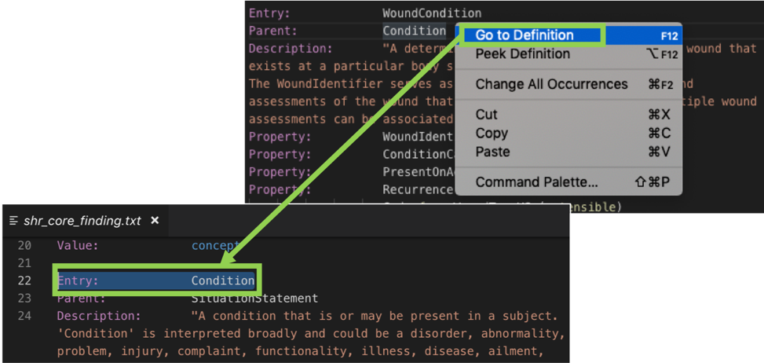

# CIMPL 6.0 Tooling Reference

_This is a comprehensive guide to CIMPL 6.0 Tooling, including the command line interface, auxiliary files, and configurations needed to produce a FHIR Implementation Guide (IG). If you're looking for a quick introduction to CIMPL and SHR-CLI environment setup, try the [Hello World](cimpl6Tutorial_helloWorld.md) or [In-Depth Tutorials](cimpl6Tutorial_detail.md). For details of the CIMPL language itself, see the [CIMPL Language Reference Manual](cimpl6LanguageReference.md)._

***

**Table of Contents**

[TOC]

***

## Overview

This reference manual describes the configurations, files, and commands needed to create a FHIR IG from CIMPL (**C**linical **I**nformation **M**odeling **P**rofiling **L**anguage). It assumes that the CIMPL Language files (classes, value sets, and maps) have been defined (see [CIMPL Language Reference Manual](cimpl6LanguageReference.md) for details). It also assumes that the CIMPL SHR-CLI tooling has been installed according to the directions in the [Setup and Installation Guide](cimplInstall.md).

The CIMPL Tooling, also called SHR-CLI (Standard Health Record Command Line Interface), is the engine that imports a set of inputs, including CIMPL language files, and exports FHIR and other outputs, as shown below:


The inputs to SHR-CLI include:

* [CIMPL Language files](cimpl6LanguageReference.md), including class files, value set files, and mapping files that define your clinical information model,
* A [Configuration file](#configuration-file) that contains directives to the tooling, and points to other resources,
* An optional [Content Profile](#content-profile-file) file, which specifies Must-Support elements and profiling options specific to an IG,
* One or more [Front Matter](#front-matter-files) files, which are the narratives and graphics that introduce the IG,
* [FHIR Examples](#fhir-examples) that are to be included in the IG, and
* A [Package List](#package-list-file) that has information required for building the IG.

The inputs are processed in the following sequence:

* The user [issues a build command](#executing-shr-cli) through the command-line interface (CLI) to launch SHR-CLI.
* The CIMPL tooling imports definitions from CIMPL files (class, value set, and map files). SHR-CLI [reports any errors](#addressing-error-messages) in the CIMPL definitions.
* Continuing the build process, SHR-CLI selects a subset of the data models to include in the IG, according to the [filter strategy](#filter-strategy-configuration-parameters).
* To complete the build process, SHR-CLI exports the selected CIMPL definitions into desired formats, such as FHIR profiles, data dictionaries, etc. The exports can be selected through [command line options](#executing-shr-cli). 
* The user [issues a separate command](#creating-the-implementation-guide) to produce the IG.

SHR-CLI produces one or all of the following outputs, depending on configuration parameters:

* [FHIR Profiles, Extensions, Value Sets](#fhir-export) that form the core content of the IG,
* A [Logical Model](#logical-model-export) corresponding to the CIMPL class definitions, expressed as FHIR StructureDefinitions,
* [JSON Schema](#json-schema-export) for the profiles defined by the IG,
* A [Data Dictionary](#data-dictionary-export) that lists the Must-Support data elements in the IG, as well as value sets and value set members,
* [Model Documentation](#model-documentation-export) in the form of a [Javadoc-like](#https://docs.oracle.com/javase/7/docs/api/) browser that allows one to see the hierarchical class relationships in the logical model.


### Relationship of CIMPL Models and Implementation Guides

It is important to understand the relationship between models defined in CIMPL and implementation guide(s) created from those models.

The state-of-practice for FHIR IGs is still evolving, but currently, most IGs are developed by separate groups and define their own data models, as follows:


The drawback of this approach is that different IGs can require very similar data models. If different data models are developed by different teams, interoperability will suffer.

In CIMPL, data models are independent of IGs. IGs are _consumers_ of models, rather than _owners_ of models (although new models can certainly be created in the context of IG development). Each IG uses a different subset of models, reflecting the different use cases they address, but the commonality of data models assures interoperability between the use cases. This idea is illustrated below:


Much of what is discussed subsequently reflects this conceptual picture of the relationship between CIMPL models and IGs.

## Conventions

### Suggested Directory Structure

The SHR-CLI tooling does not require a particular directory structure. However, following conventions makes the process of managing the requisite files much easier. Here is an example of the suggested arrangement that assumes the same IG can be produced under FHIR STU3 and R4:

```
├── shr-cli-6.5.0                   // Tooling location
|
...
|
├── spec                            // Main specification directory
|   ├── ns-namespace1                   // Namespace directories
|   |   ├── namespace1-foo.txt               // class file(s)
|   |   ├── namespace1-bar.txt
|   |   ├── namespace1-foo-vs.txt            // value set file(s)
|   |   ├── namespace1-bar-vs.txt
|   |   ├── namespace1-foo-map-stu3.txt      // map(s) for FHIR STU3
|   |   ├── namespace1-bar-map-stu3.txt
|   |   ├── namespace1-foo-map-r4.txt        // map(s) for FHIR r4
|   |   └── namespace1-bar-map-r4.txt
|   ├── ns-namespace2
|   | ...
|   ├── ns-namespace3
|   | ...
|   | ...
|   ├── ig-myguide1                 // IG directories
|   |   ├── myguide1-examples           // directory of examples
|   |   |   ├── example1
|   |   |   └── example2
|   |   ├── myguide1-frontmatter        // directory containing narratives
|   |   |   ├── index.html
|   |   |   ├── picture.png
|   |   |   └── another-page.html
|   |   ├── myguide1-stu3-cp.txt        // content profile file for FHIR STU3 IG
|   |   ├── myguide1-r4-cp.txt          // content profile file for FHIR R4 IG
|   |   ├── myguide1-stu3-plist.json    // package list for FHIR STU3 IG
|   |   ├── myguide1-r4-plist.json      // package list for FHIR R4 IG
|   |   ├── myguide1-stu3-config.json   // config file for FHIR STU3 IG
|   |   └── myguide1-r4-config.json     // config file for FHIR R4 IG
|   ├── ig-myguide2
|   |  ...
```
In this reference guide, we will refer to several directories:

* **Tooling Directory** - this the directory where the SHR-CLI tooling has been installed. Any convenient directory can be used. For easy identification, we recommend the tooling version number be included in the directory name.
* **Specification Directory** - this is the top level directory where the input files and are located, usually arranged in sub-folders. Any convenient directory can be used. If you are using a source code control system such as Github to manage your development, this could be where the repository is checked out to your local machine.
* **Namespace Directories** - these directories, located under the Specification Directory, contains CIMPL language files for a single namespace. The name of the directory should be prefixed with `ns-` followed by the shortname or acronym of the namespace followed .
* **IG Directories** - these directories, under the specification directory contain files specific to a given implementation guide. There are subdirectories containing the front matter and examples, and individual configuration, content profile, and package list files. These files can be specific to a FHIR release, since the same IG could be created using different versions of FHIR.

**Note:** There is currently no way to combine profiles for multiple FHIR versions in single IG.

### Suggested File Naming

The naming of configuration, content profiles, and package list files is arbitrary, but it is useful for different teams to follow similar conventions. The suggested approach to naming uses variations on the same shortened IG name, as follows:

* Configuration file: `ig-<guide-name>-config.json`
* Content Profile file: `ig-<guide-name>-cp.txt`
* Package List file: `ig-<guide-name>-plist.json`

If your project will support more than one FHIR version, the FHIR version should be included:

* Configuration file: `ig-<guide-name>-<FHIR Version>-config.json`
* Content Profile file: `ig-<guide-name>-<FHIR Version>-cp.txt`
* Package List file: `ig-<guide-name>-<FHIR Version>-plist.json`

where FHIR version is dstu2, stu3, or r4.

## Inputs to SHR-CLI
### CIMPL Files

Any text editor can be used to write CIMPL grammar. However, [VSCode editor](https://code.visualstudio.com/) is recommended to take advantage of a CIMPL plug-in.

#### Setting up the VSCode Authoring

>**Note:** VSCode UI screenshots in this section were taken from a MacOS environment. While the overall functionality is the same across supported OS platforms, installation and configuration specifics might differ. Reference the VSCode documentation pertinent to your OS platform.

* Download the [VSCode editor](https://code.visualstudio.com/). 
* Open VSCode, open the extensions panel, and search for the extension **vscode-lang-cimpl**. The figure below shows where to find VSCode extensions on MacOS (on Windows, navigate _View -> Extensions_). Alternatively, select the extension icon (the squarish icon on the far left).


#### Navigating a CIMPL Model within VSCode

The inherited properties of Groups and Entries can be previewed in the following ways:

1. **Hovering over the element**: This provides a drop-down list of all properties and cardinality of a Group or Entry (including inherited properties).
2. **Placing the cursor on the class declaration, right-click and select _Peek Definition_**: This will display a drop-down window with a preview of the definition. The name and location of the file will be displayed although the entire file will not be opened.
3. **Placing the cursor on a property declaration and right-clicking option _Go to Definition_**: This will redirect the editor to location of the definition, opening the file if necessary.

Hovering over the element:


Using _Peek Definition_:


Using _Go to Definition_:




### Configuration File

SHR-CLI requires a configuration file to run. The name of this file is typically specified on the command line [using the -c command line option](#executing-shr-cli). If the name is not specified, the tooling looks for a file named `config.json` in the working directory. If that cannot be found, or the contents of the configuration file are invalid, an error message is returned.

The configuration file is a [JSON file](https://www.json.org/) with the following parameters:

|Parameter            |Type    |Description                                                    |
|:--------------------|:-------|:--------------------------------------------------------------|
|`projectName`        |`string`|The full, official name of the project, for example "HL7 FHIR Implementation Guide: minimal Common Oncology Data Elements (mCODE) Release 1 - US Realm, STU Ballot 1"  |
|`projectShorthand`   |`string`|A shorthand name for the project, such as "mcode".                              |
|`projectURL`         |`string`|The primary URL for the project, such as "http://hl7.org/fhir/us/mcode/"                             |
|`fhirURL`            |`string`|The FHIR IG URL for the project, often the same as the projectURL. **(TO DO: clarify the difference between projectURL, fhirURL, and entryTypeURL)**  |
|`fhirTarget`         |`string`|The FHIR version this IG will be based on, currently a choice of `"FHIR_R4"`, `"FHIR_STU_3"`, or `"FHIR_DSTU_2"`|
|`entryTypeURL`       |`string`|The root URL for the JSON schema `EntryType` field. **(TO DO: clarify where and how this is used)**   |
|`filterStrategy`     |`{}` |A JSON object containing configuration for filtering ([see below](#filter-strategy-configuration-parameters)).              |
|`contentProfile`     |`string`| The file name of the content profile for the project.    |
|`implementationGuide`|`{}`    |A JSON object containing configuration for IG publishing ([see below](#implementation-guide-configuration-parameters)).          |
|`copyrightYear`      |`string`|The copyright year to include in the documentation.            |
|`publisher`          |`string`|The name of the publisher for the project, which for HL7 projects, should be the sponsoring workgroup, for example, "HL7 International Clinical Interoperability Council".  |
|`contact`            |`[]`    |A JSON array containing HL7 FHIR R4 [ContactPoint objects](http://hl7.org/fhir/R4/datatypes.html#ContactPoint).  |
|`provenanceInfo`     |`{}`    | A JSON object specifying author and other information ([see below](#provenance-information-configuration-parameters)) |

#### Filter Strategy Configuration Parameters

Between the import stage and the export stage, there is a filtering stage (see  [CIMPL Tooling Overview](#cimpl-tooling-overview)). Filtering is useful when [specification directory](#suggested-directory-structure) contains namespaces that or entries that are outside the scope of the current IG, and should not be included in the IG. Filtering removes unwanted namespaces and entries to limit the scope of the exports, and subsequently, the IG.

The contents of the `filterStrategy` object are as follows:

|Parameter |Type |Description |
|---------|------|------------|
|`filter`  |`boolean`|A value indicating whether to enable filtering. If `filter` is `true`, then the filtering operation will occur. Otherwise, no filtering will occur. (Also, if the `filterStrategy` parameter is entirely omitted, no filtering will occur.) |
|`strategy`|`string` | The strategy for specification filtering, either "namespace", "element", or "hybrid".|
|`target`  |`[]`     |An array of strings containing the names of Entries, Namespaces, or both. |

* The "element" strategy filters the imported classes to include each Entry listed in the `target` array, and their recursive dependencies.
* The "namespace" strategy filters the imported classes to include only Entries in the namespaces listed in the `target` array, and their recursive dependencies.
* The "hybrid" strategy filters the imported classes to include each Entry listed in the `target` array and all Entries in every namespace listed in the `target` array, and their recursive dependencies.

When specifying an Entry in the `target` array, use the [fully qualified name (FQN)](cimpl6LanguageReference.md#fully-qualified-names) format.

#### Implementation Guide Configuration Parameters

These configurations are used to control the production of the IG. The contents of the `implementationGuide` object are as follows:

|Parameter                 |Type     |Description                                                          |
|:-------------------------|:--------|:--------------------------------------------------------------------|
|`npmName`                 |`string` |The assigned node package manager name for this IG, for example "hl7.fhir.us.mcode". The npm name is usually assigned by HL7.   |
|`version` |`string` |The version of this IG (not necessarily the version of FHIR), usually in the form _major.minor.revision_, for example, "3.0.1"  |
|`ballotStatus`            |`string` |The HL7 ballot status of the IG (e.g., STU1 Ballot, Continuous Integration Build, etc.)      |
|`packageList` |`string` |The name of the file to use as the [IG's package list](#package-list-file), relative to the Specification Directory. |
|`includeLogicalModels`    |`boolean`|A "true" or "false" value indicating whether to include logical models in the IG.     |
|`includeModelDoc`         |`boolean`|A "true" or "false" value indicating whether to include the model documentation in the IG. |
|`indexContent` |`string` |The name of the file or folder containing the [front matter](#front-matter-files), relative to the Specification Directory, for example, "ig-mcode/IndexFolder-Oncocore". If the `indexContent` is a folder, then it must contain an `index.html` file whose contents will be used as the body of the IG home page.  |
|`extraResources`          |`string` |The name of the folder containing extra JSON resources to include in the IG, one file per resource. Currently, the following resource types are supported: `SearchParameter`, `OperationDefinition`, `CapabilityStatement` (STU3+), `Conformance` (DSTU2).  If files are detected, links are added to the navigation menu as necessary. |
|`examples` |`string` |The name of the folder containing examples (one example per file) to include in the IG, for example, "ig-mcode/Examples-mCODE-r4". We recommend the individual example file name match the `id` in the example file (with `.json` extension added). The example's `meta.profile` must match the canonical URL for the profile it exemplifies (e.g. `"meta": { "profile": [ "http://hl7.org/fhir/us/breastcancer/StructureDefinition/oncology-BreastCancerPresenceStatement" ] }`). If no `examples` folder is specified, and a folder named "fhir-examples" exists in the specification directory, it will be used as the examples folder. | 
|`historyLink`             |`string` |The URL for the page containing the IG's history information.  **(TO DO: clarify where and how this is used)**   |
|`changesLink`             |`string` |The URL to a site where users can request changes (shown in page footer) **(TO DO: clarify where and how this is used)** |
|`primarySelectionStrategy`|`{}`     |The strategy for selection of what is primary in the IG (see below). |

The primary selection strategy causes certain profiles to be displayed in a "Primary" section at the top list of profiles. All other exported profiles are listed in a "Supporting" section below the "Primary" section. The contents of the `primarySelectionStrategy` object are as follows:

|Parameter |Type    |Description |
|--------|------|-----------|
|`strategy`|`string`|The strategy to follow for primary selection, either "namespace", "hybrid", or "entry" (default). |
|`primary` |`[]`|An array of strings containing the namespaces and entries (only used for "namespace" and "hybrid" strategy). |

The `strategy` options are as follows:

* "entry" selects every exported profile as primary.
* "namespace" selects every profile found in the namespaces of the `primary` array as primary.
* "hybrid" selects every entry listed in the `primary` array or found in the namespaces in the `primary` array as primary.

When specifying an Entry in the target array, use the fully qualified name (FQN) format.

#### Provenance Information Configuration Parameters

**(TO DO: document what this structure can contain)**

Here is an example of provenanceInformation:

```
    "provenanceInfo": {
        "leadAuthor": {
            "name":"Example Author",
            "organization": "Example Publisher",
            "email": "example@example.org"
        },
        "license": "Creative Commons CC-BY <https://creativecommons.org/licenses/by/3.0/>",
        "copyright": "Copyright (c) The Example Organization <http://example.org>"
    }
```

### Front Matter Files

Every IG contains some amount of narrative content, which we refer to as the "[front matter](https://www.scribendi.com/advice/front_matter.en.html)". The front matter is typically a set of hyperlinked HTML files, graphics, and sometimes, downloads. These files are manually authored using any convenient tool; there are no special facilities in CIMPL to author the front matter.

If multiple files are involved, they must be placed into a single folder, named in the `indexContent` parameter of the [configuration file](#configuration-file). This folder must contain a file named `index.html` whose contents will be used as the body of the IG home page (the header and footer of the pages are automatically generated).

If a single file is used, the file should be named in the `indexContent` parameter of the configuration file, and a folder is not required.

### FHIR Examples

Configuring FHIR examples to appear in the generated IG involves the following steps:

* Create a folder which will contain your FHIR examples
* Modify the CIMPL configuration file to specify the folder containing your examples

The name of the folder is arbitrary, however, following [directory structure](#suggested-directory-structure) and [naming conventions](#suggested-file-naming) is recommended.

The folder location is specified using the `"examples:"` parameter in the CIMPL configuration file.  This is illustrated below:


### Package List File

The format and content of this file follows the [FHIR specification for package lists](http://wiki.hl7.org/index.php?title=FHIR_IG_PackageList_doco). The package list is required for IGs published by HL7. The file containing the package list is named by the `packageList` parameter of the [configuration file](#configuration-file). If the `packageList` parameter is not supplied and no file is found at the default location (packageList.json), and `fhirURL` is an hl7.org or fhir.org URL (indicating it is an HL7 publication), then a basic package list file will be created. In this case, the IG author should review and modify the file as needed.

Here is an example of a package list file:

```
{
  "package-id": "hl7.fhir.us.mcode",
  "title": "HL7 FHIR Implementation Guide: minimal Common Oncology Data Elements (mCODE) Release 1 - US Realm | STU Ballot 1",
  "canonical": "http://hl7.org/fhir/us/mcode",
  "list": [
    {
      "version": "current",
      "desc": "Continuous Integration Build (latest in version control)",
      "path": "https://build.fhir.org/ig/HL7/fhir-mCODE-ig",
      "status": "ci-build",
      "current": true
    },
    {
      "version": "0.9.1",
      "date": "2019-06-10",
      "desc": "Initial version",
      "path": "http://hl7.org/fhir/us/mcode/2019Sep",
      "status": "draft",
      "sequence": "STU 1",
      "fhir-version": "4.0.0"
    }
  ]
}
```

### Content Profile File

In FHIR, [Must-Support](https://www.hl7.org/fhir/conformance-rules.html#mustSupport) is a boolean flag which allows a profile to indicate that an implementation must be able to process that element in a FHIR instance if it exists. The Content Profile is where Must-Support elements are declared.

Note that the Must-Supports are designated at the level of the IG, not the data model. This is because different elements are important for different use cases. For example, one use case may not require date of death to be supported, but another might.

**Note:** [Filtering](#filter-strategy-configuration-parameters) is the mechanism by which entries (profiles) and namespaces are selected for an IG, and content profiles are the mechanism for declaring Must-Support.

The syntax of a Content Profile file is:

```
Grammar:  ContentProfile 1.0

Namespace:  <namespace-1>
    <Entry-1>:
        <Element-1> MS
        <Element-2> MS
        ...
    <Entry-2>:
    ...
Namespace:  <namespace-2>
    <Entry-1>:
        <Element-1> MS
        <Element-2> MS
        ...
    <Entry-2>:
    ...
```

Here is an excerpt from a Content Profile file:

```
Grammar:        ContentProfile 1.0

Namespace: obf
    ComorbidCondition:
        Code MS
        ClinicalStatus MS
    MedicationStatement:
        MedicationCodeOrReference  MS
        OccurrenceTimeOrPeriod  MS
        TerminationReason  MS
        TreatmentIntent  MS
    ECOGPerformanceStatus:  
        DataValue MS

Namespace: vital
    BloodPressure:
        Components.ObservationComponent MS
        RelevantTime MS
    BodyHeight:
        DataValue MS
        RelevantTime MS
    BodyWeight:
        DataValue MS
        RelevantTime MS

Namespace: onco.core
    PrimaryCancerCondition:
        Code MS
        ClinicalStatus MS
        BodyLocation.Code MS
        HistologyMorphologyBehavior MS
        DateOfDiagnosis MS
```

**Note:** The grammar of the Content Profile file is still evolving and may include additional information in the future.

## Executing SHR-CLI

### Command Line

The general form of the SHR-CLI execution command is as follows (where $ stands for the command prompt, which could be different on your system):

$ `node <tooling-directory> <specification-directory> [options]`

where options include:

```
-c, --config <config>    the name of the config file (default: config.json)
-l, --log-level <level>  the console log level <fatal, error, warn, info, debug, trace> (default: info)
-s, --skip <feature>     skip an export feature <fhir, json-schema, model-doc, data-dict, all> (default: <none>)
-o, --out <out>          the path to the output folder (default: out)
-m, --log-mode <mode>    the console log mode <short,long,json,off> (default: short)
-d, --duplicate          show duplicate error messages (default: false)
-j, --export-es6         export ES6 JavaScript classes (experimental, default: false)
-n, --clean              Save archive of old output directory and perform clean build (default: false)
-h, --help               output usage information
```

The options are not order-sensitive. Here is an example of a SHR-CLI command and an explanation of its parts:

$ `node . ../shr_spec/spec -c ig-mcode/ig-mcode-r4-config.json -l error`

* `node` is the command that starts the SHR-CLI application.
* The dot `.` represents the current directory in Windows and macOS. In this example, the tooling directory is the current working directory.
* `../shr_spec/spec` represents the location of the specification directory. The the double dot `..` represents the directory above the current working directory, in Windows and macOS. In this case, `/shr_spec` is parallel to the tooling directory, and `/spec` is one level below that.
* `-c ig-mcode/ig-mcode-r4-config.json` directs the execution engine to the configuration file. Note that the configuration file location is relative to the specification directory, implying the full path to the configuration is `../shr_spec/spec/ig-mcode/ig-mcode-r4-config.json`
* `-l error` is an option that sets tells the system to surpress any messages that don't rise to the level of an `error`. This reduces the amount of output to the console window.

### Addressing Error Messages

In the process of building a model, it is inevitable that you will encounter error messages from SHR-CLI. Debugging the model is an iterative process, and it could take some perseverance to arrive at a "clean" run of SHR-CLI with no errors. This is an expected part of the process.

A detailed list of CIMPL compilation errors and troubleshooting suggestions are available in **[Appendix A](#appendix-a-error-messages)**.

Here are some general tips on approaching debugging your model:

* Always eliminate [parsing errors](#parsing-errors) first. **Parsing errors can be identified because they include a file, line number, and column number.** It is essential to elminate parsing errors first, because parsing errors usually trigger large cascades of other errors, so you can't truly start debugging your model until parsing errors have been eliminated.
* Once all parsing errors have been eliminated, start working top down on the first (or first few) errors. Often, subsequent errors are a consequence of the first error.
* Don't be discouraged by the number of errors, since a single correction can silence multiple logged errors.
* Read the error messages carefully. Although the messages might be cryptic, especially at first, the names of classes and paths are often excellent clues.

## Outputs from SHR-CLI

The output of running SHR-CLI appear in a directory named "out". By default, the /out directory is created in the tooling directory. A different location can be designated using the `-o` [command line option](#executing-shr-cli).

The content of the /out directory depends on which exporters were selected to run, which is controlled using the `-s` command line option. By default, the /out will contain five exports, as shown below, each corresponding to a separate export process:


* cimcore - this directory is used in the process of building the "modeldoc" export, and is not discussed further
* [data-dictionary](#data-dictionary-export) - this directory contains an MS-Excel spreadsheet containing a list of model elements and value sets
* [fhir](#fhir-export) - this directory contains all the definitions and assets necessary to produce the IG
* [json-schema](#json-schema-export) - this directory contains schemas for the (**TO DO -- need to define the JSON schema export**)
* [modeldoc](#model-documentation-export) - this directory contains files that present the model with a look and feel similar to [Javadoc](#https://www.oreilly.com/library/view/learn-to-program/9781680500523/f_0126.html)

### FHIR Export

The FHIR export consists of profiles, extensions, value sets, code systems, examples, and other artifacts needed to create a FHIR IG. These are not the _pages_ of the IG, but rather various definitions that underlie the IG presentation. You must run the [IG publisher](#creating-the-implementation-guide) to create the IG itself.

The FHIR export appears in the /fhir subdirectory under the designated "out" directory. The directory contains further subdirectories for code systems, extensions, the IG (guide), the logical model (logical), profiles, and value sets.

#### Logical Model Export

The logical model is an alternative representation of the CIMPL model, expressed in a familiar FHIR-like format. The logical model closely follows the CIMPL definitions because it reflects the model _prior to_ mapping to FHIR resources. Each entry is presented as if it were a new FHIR resource, rather than a profile. The logical model is formally expressed as a set of FHIR `StructureDefinitions`. These definitions are distinguished from profiles because the names generated by the tooling end in `-model`.

Because the logical model does not entail the additional complication of mapping, it is useful for review purposes. The logical model can be checked for clinical relevance and sufficiency before making mapping decisions.

An optional part of the FHIR export, the logical model can be turned on or off using the `includeLogicalModels` flag in the configuration file.


### Model Documentation Export

The model documentation provides another way to view the logical model. This view emphasizes the class hierarchy defined in CIMPL, the datatypes, associated constraints, and relationships between the classes (references). The panel in the upper left allows the user to filter on the namespace and (in SHR-CLI 6.6 and higher) the class type (Entry, Group, or Element). The right-hand panel shows details for the selected class, include the full set of properties and constraints. 

For many users, especially those with experience in object-oriented modeling, the model documentation is the quickest way to navigate around the model.


### Data Dictionary Export

The Data Dictionary is an Microsoft Excel file containing a simplified, flattened list of model elements and value sets, extracted from the FHIR profiles. The spreadsheet has five tabs:

* The "Key" tab contains a key to the columns in the other tabs;
* The "Profiles" tab contains a list of the primary profiles and their descriptions;
* The "Data Elements" tab contains a list of Must-support and required elements associated with those profiles;
* The "Value Sets" tab contains a list of value sets used in the IG, and their descriptions;
* The "Value Set Details" tab contains a list of the codes and/or implicit definitions in those value sets.

The Data Dictionary can be useful both to clinicians and implementers who don't need the structural details of the FHIR profiles, but want the contents in list form. For many reviewers and contributors, this can be an easy-to-use format to facilitate discussion and feedback.

### JSON Schema Export

(**TO DO: determine what to say here**)

## Creating the Implementation Guide

The final step in the IG creation process is to run the [FHIR IG Publisher](http://wiki.hl7.org/index.php?title=IG_Publisher_Documentation). This tool is maintained and owned by HL7 FHIR.

Open a command prompt, change directories to the tooling directory, and use one of these two options:

* If you used the default "out" directory when running SHR-CLI:

  $  `yarn run ig:publish`

* If you used a different "out" directory (e.g., mypath/out):

  $  `java -Xms4g -Xmx8g -jar mypath/out/fhir/guide/org.hl7.fhir.publisher.jar -ig mypath/out/fhir/guide/ig.json`

**Note:** The IG publisher can take 15-30 minutes or even longer to run, depending on the size of the IG, and it takes _lots_ of memory. The yarn script above will allocate up to 8GB of RAM. A minimum of 4GB of RAM is recommended to run the IG Publisher tool.

When the publisher finishes, the IG can be opened by running the following commands.

* If you used default "out" directory:

  $  `yarn run ig:open`

* If you used a different "out" directory, by manually opening the file  `mypath/out/fhir/guide/output/index.html`

You now have your completed IG.

The FHIR IG Publisher performs numerous validation checks on the content of the IG. The output of these checks can be accessed through the "QA Report" link in the footer of the home page, or by opening the file `/out/fhir/guide/output/qa.html`.

An example QA output is shown below:


## Appendix A: Error Messages

In the following, `$` prefix indicates a variable that will be filled in with specific information.

### Table of Contents

* **[Error Code Structure](#error-code-structure)**
* **[Parsing Errors](#parsing-errors)**
* **[Warning Codes](#warning-codes)**
* **[Compilation Error Codes](#compilation-error-codes)**
* **[Mapping Error Codes](#mapping-error-codes)**

### Error Code Structure

CIMPL Compilation Errors are structured in the following format:

***1*** 2 3 4 5 <br>
&nbsp;↳&nbsp;First digit tells whether it is an warning or error. 0 = warning, 1 = error

1 ***2*** 3 4 5 <br>
&nbsp;&nbsp;&nbsp;↳&nbsp; Second digit indicates the phase of processing where the error appeared: 1 = grammar and importing of the text files, 2 = logical verification of the model, 3 = exporting of FHIR profiles, 4 = exporting of the JSON profiles

1 2 ***3 4 5*** <br>
&nbsp;&nbsp;&nbsp;&nbsp;&nbsp;&nbsp;&nbsp;&nbsp;↳&nbsp;The last three digits are for unique identification and have no particular meaning.

### Parsing Errors

Parsing errors are generated when the importer cannot make sense of the contents of a CIMPL statement. **Parsing error messages include the file, line, and column number, and can be linked directly to a location in a CIMPL file where parsing failed.** Most other types of errors (with the exception of mapping errors) cannot be linked to a specific file location because they represent some type of a logical inconsistency.

A typical parsing error looks like this:

```
extraneous input 'Entry' expecting {<EOF>, 'CodeSystem:', 'Abstract:', 'Element:', 'Entry:', 'Group:'}.
ERROR_CODE:11023 (module=shr-text-input, file=..\shr_spec\spec\ns-onco-core\oncocore.txt, line=9, column=0)
```
When a parsing error occurs, the associated error code number and subsequent errors are not meaningful, since the entire model could not be read.

### Warning Codes

| Warning Code | Warning Message | Potential Solution |
| ------------ | --------------- | -------- |
| 01001 | No project configuration file found, currently using default EXAMPLE identifiers. Auto-generating a proper 'config.json' in your specifications folder | Open the 'config.json' file and customize it for your project. |
| 01002 | Config file missing key: `$KEY`, using default key: `$DEFAULT VALUE` instead.   | Open the 'config.json' file and add your project specific details for that key.
| 02001 | Potentially mismatched targets: `$CLASS` maps to `$ITEM`, but based on class (`$CLASS`) maps to `$ITEM`, and `$ITEM` is not based on `$ELEMENT` in `$CLASS`.' | You are overriding an inherited mapping. |
| 03001 | Trying to map `$PROFILE` to `$CODE`, but `$PROFILE` was previously mapped to it | |
| 03002 | Choice has equivalent types, so choice options may overwrite or override each other when mapped to FHIR. | |
| 03003 | Overriding extensible value set constraint from `$VS1` to `$VS2`.  Only allowed when new codes do not overlap meaning of old codes. | The "extensible" binding means that a code from outside the given value set should be used only if the value set does not contain a suitable code. |
| 03004 | Element profiled on Basic. Consider a more specific mapping. | The Basic profile should not be used in most cases. Consider a more specific profile mapping that categorizes the Element being mapped. |
| 03005 | No mapping to '`$ELEMENT PATH`'. | This property is core to the target resource and usually should be mapped. |  |
| 03006 | The `$PROPERTY` property is not bound to a value set, fixed to a code, or fixed to a quantity unit. This property is core to the target resource and usually should be constrained |Usually a result of not setting the Code attribute of an Observation. |
| 04001 | Unsupported code system: '`$CODESYSTEM`' | |

### Compilation Error Codes

| Error Code    | Error Message | Solution |
| ------------  | ------------- | -------- |
| 11001          | Element name '`$NAME`' should begin with a capital letter | Rename the specified Element |
| 11002          | Entry name '`$NAME`' should begin with a capital letter    | Rename the specified Entry |
| 11003          | Unable to resolve value set reference: `$VALUESET`                 | Invalid value set reference, double check the name and the path
| 11004          | Unsupported binding strength: `$BINDING_STRENGTH`.  Defaulting to REQUIRED     | Binding strength has to be one of the following: example, preferred, extensible, or required (default). |
| 11005          | Error parsing source path: `$PATH`                                 | Invalid path to definitions. Double check path. |
| 11006          | Invalid config file. Should be valid JSON dictionary               | Make sure your 'config.json' file is using a valid format for JSON. |
| 11007          | Unsupported grammar version: `$VERSION`                            | Grammar Version for file must be 5.0 (or above) |
| 11008          | Defining value sets by URL has been deprecated in ValueSet files.  ValueSet `$VALUESET` ignored.           | Define the value set with a name using proper syntax. |
| 11009          | Defining value sets by URN has been deprecated in ValueSet files.  ValueSet `$VALUESET` ignored.           | Define the value set with a name using proper syntax. |
| 11010          | Couldn’t resolve code system for alias: `$ALIAS`                   | Invalid Codesystem, double check spelling |
| 11011          | Uses statements have been deprecated in ValueSet files.  Uses statement ignored.                  | Uses statement is unnecessary. Refer to documentation for proper syntax |
| 11012          | Only default path definitions are allowed in ValueSet files.  Path definition ignored.            | Use one of the preset path definitions defined in the documentation. |
| 11013          | Failed to resolve definition for `$ELEMENT_NAME`                   | The referenced Element doesn't exist in the current namespace, or in any of its inherited parents. Check spelling errors as well as imports. |
| 11013          | Failed to resolve definition for `primitive`                       | Only certain primitives are supported. Please refer to the documentation to see the full list.
| 11015          | token recognition error at: `$CHARACTER` | This is usually a typo issue. Investigate keywords and missing colons around the specificed text input.
| 11016          | mismatched input `$INPUT` expecting `$LIST_OF_KEYWORDS` | This is usually a typo issue. Investigate spelling and keywords used around the specificied text input.
| 11017          | Cannot resolve path without namespaces | There was a failure to parse the namespace. Ensure the namespace is correctly defined.
| 11018          | Failed to resolve path for `$NAME`. |
| 11019          | Found conflicting path for `$NAME` in multiple namespaces: `$NAMESPACES` | 
| 11020          | Failed to resolve vocabulary for `$NAME`. | 
| 11021          | Found conflicting vocabularies for `$NAME` in multiple namespaces: `$NAMESPACES` | 
| 11022          | Found conflicting definitions for `$NAME` in multiple namespaces: `$NAMESPACES` | 
| 11023          | Elements cannot be based on "Value" keyword |
| 11024          | Elements cannot use "Value:" modifier and specify "Value" field at same time. |
| 11025          | Fields cannot be constrained to type "Value" |
| 11026          | ref(Value) is an unsupported construct; treating as Value without the reference. |
| 11027          | Unable to import property `$FQN`, unknown value type: `$VALUE_TYPE` | The type either does not exist, or the import tool needs to be updated.
| 11028          | Unable to import unknown constraint type: `$CONSTRAINT_TYPE`| The type either does not exist, or the import tool needs to be updated.
| 11029          | Unable to import mapping, unknown rule type: `$RULE_TYPE` | The type either does not exist, or the import tool needs to be updated.
| 11030          | Unable to import VS rule, unknown rule type: `$RULE_TYPE` | The type either does not exist, or the import tool needs to be updated.
| 11031          | Unable to import FixedValueConstraint, unknown fixed value type: `$RULE_TYPE` | The value type either does not exist, or the import tool needs to be updated.
| 11032          | Project configuration not found! Exiting the program. | There was an error finding or loading the configuration file. Please double check that it exists and is valid.
| 11033          | Name $ELEMENT_ENTRY_NAME already exists. | The entity or element name already exists within the namespace and the most recently defined element or entry name will be used.
| 11034          | ValueSet name $VS_NAME already exists. | The value set name already exists within the namespace.
| 11035          | Definition not found for data element in content profile path: `$ELEMENT_FQN`. | Could indicate a missing definition, misspelling, or missing `Uses` declaration. |
| 11036          | Path not found for `$ELEMENT_FQN`: `$PATH`. | Usually when sub-elements in a dotted path (foo.bar.baz) can't be traced. See [CIMPL path](#cimpl6LanguageReference.md#cimpl-paths) for more information. |
| 11037          | Could not find content profile file: `$FILE_NAME`. | Check the name or path to the content profile file specified in your configuration file. |
| 11038          | Namespace declaration not found. | File needs a namespace declaration at the top of the file under the Grammar declaration. |
| 11039          | Grammar declaration not found. | File needs a Grammar declaration at the top of the file. |
| 11040          | Property `$PROPERTY` already exists. | Extra declaration of Property needs to be removed. |
| 11041          | Choice value constrained without specifying the specific choice. |
| 11042          | Constraint refers to previous identifier. |
| 11043          | Value should not be declaring cardinality. | Remove cardinality declared for the value. |
| 11044          | Missing a value element. |
| 12001          | Cannot resolve element definition.                                 | Element doesn't exist. Double check spelling and inheritance |
| 12002          | Reference to non-existing base: `$ELEMENT_NAME`                    | Base doesn't exist. Double check spelling and inheritance. |
| 12003          | No cardinality found for value: `$VALUE`                           | Explicitly define cardinality for that value. |
| 12004          | No cardinality found for field: `$FIELD`                           | Explicity define cardinality for that field. |
| 12005          | Cannot override `$OLD_VALUE` with `$NEW_VALUE`                                                | Double check types match. |
| 12006          | Cannot override `$OLD_VALUE` with `$NEW_VALUE` since it is not one of the options             | Verify Identifiers match. |
| 12007          | Cannot override `$OLD_VALUE` with `$NEW_VALUE`                                                | Verify Identifiers match. |
| 12008          | Cannot override `$OLD_VALUE` with `$NEW_VALUE` since overriding ChoiceValue is not supported  | Verify Identifiers match. |
| 12009          | Unsupported constraint type: `$CONSTRAINT` Invalid constraint syntax.    | Consult documentation to see what constraints are supported |
| 12010          | Cannot constrain cardinality of `$NAME` from `$SMALL_CARDINALITY` to `$BIGGER_CARDINALITY`              | You can only narrow the cardinality. You cannot constrain it to have a larger range than its parent |
| 12011          | Cannot further constrain cardinality of `$NAME` from `$CARDINALITY` to `$CARDINALITY`  | You can only narrow the cardinality. You cannot constrain it to have a larger range than its parent |
| 12012 | Cannot constrain type of `$NAME` to `$TYPE`  | Make sure base types match |
| 12013 | Cannot constrain type of `$NAME` since it has no identifier        | Invalid Element |
| 12014  Cannot constrain type of `$NAME` to `$TYPE` | Make sure base types match |
| 12015  | Cannot further constrain type of `$NAME` from `$TYPE` to `$TYPE`   | The two elements aren't based on the same parent. You cannot constrain an element to one that is completely distinct. |
| 12017 | Cannot constrain type of `$NAME` since it has no identifier| |
| 12018 | Cannot constrain element `$NAME` to `$TARGET` since it is an invalid sub-type | Element has to be based on `$s` or otherwise is a child of `$s`. |
| 12020 | Cardinality of `$NAME` not found | Please explicitly define the cardinality. |
| 12021 | Cannot include cardinality on `$NAME`, cardinality of `$CARD` doesnt fit within `$CARD` | The cardinality of included parameters must be as narrow or narrower than the  property it contains. |
| 12022 | Cannot constrain valueset of `$NAME` since it has no identifier    | |
| 12023 | Cannot constrain valueset of `$NAME` since neither it nor its value is a concept | Only elements whose datatype is `concept` can be bound to a value set. |
| 12024 | Cannot constrain valueset of `$NAME` since it is already constrained to a single code |  |
| 12025 | Cannot constrain code of `$NAME` since neither it nor its value is a concept |  |
| 12026          | Cannot constrain included code of `$NAME` since neither it nor its value is a concept |  |
| 12027  | Cannot constrain boolean value of `$NAME` since neither it nor its value is a boolean  | You may be trying to set an element that is not a boolean to true or false. |
| 12028 | Cannot constrain boolean value of `$NAME` to `$VALUE` since a previous constraint constrains it to `$VALUE` | Once a fixed constraint is applied, it cannot be changed in a child class. In this case, you might be switching a true to a false or vice versa. |
| 12029          | Cannot resolve element definition for `$NAME`                      | This is due to a incomplete definition for an element. Please refer to the document for proper definition syntax. |
| 12030          | Cannot determine target item | System error. |
| 12031 | Cannot resolve data element definition from path: `$PATH` | Check spelling for field or value. |
| 12032 | Cannot resolve data element definition from path: `$PATH`          | Check spelling for field or value. |
| 12033  | Cannot map Value since element does not define a value| Define a value for your element |
| 12034 | Cannot map Value since it is unsupported type: `$VALUE_TYPE` |  |
| 12035  | Found multiple matches for field `$FIELD` | Please use fully qualified identifier. |
| 12036  | Could not find expanded definition of `$ELEMENT`. Inheritance calculations will be incomplete. | Double check `shr.base.Entry` is defined within the specifications. |
| 12037  | Could not find based on element `$ELEMENT` for child element `$ELEMENT`. | Double check the `basedOn` element is defined within the specifications and correctly referenced. |
| 14001  | Unsupported value set rule type: `$s` |
| 14002          | Unknown type for value `$VALUE` |
| 14003          | Unknown type for constraint `$CONSTRAINT` |

### Mapping Error Codes

| Error Code    | Error Message | Solution |
| ------------  | ------------- | -------- |
| 13001          | Invalid FHIR target: `$TARGET` | Could not find the FHIR resource or profile you're trying to map to. Check spelling and FHIR version. |
| 13002          | Cannot flag path as mapped |
| 13003          | Slicing on include type constraints with paths is not supported |
| 13004          | Slicing required to disambiguate multiple mappings to `$TARGET` |
| 13005          | Invalid source path |
| 13006          | Invalid or unsupported target path |
| 13007          | Cannot unroll contentReference `$CONTENT_REFERENCE` on `$ELEMENT` because it is not a local reference |
| 13008          | Invalid content reference on `$ELEMENT`: `$CONTENT_REFERENCE` |
| 13009          | Cannot unroll `$ELEMENT`. Create an explicit choice element first. |
| 13010          | Cannot unroll `$ELEMENT` at `$ELEMENT`: invalid SHR element. |
| 13011          | Cannot make choice element explicit since it is not a choice ([x]): `$ELEMENT` |
| 13012          | Cannot make choice element explicit at `$ELEMENT`. Invalid SHR identifier: `$IDENTIFIER`. |
| 13013          | Invalid target path. Cannot apply cardinality constraint. |
| 13014          | Cannot constrain cardinality from `$CARD` to `$CARD` |
| 13015          | Invalid target path. Cannot apply fixed value. |
| 13016          | Currently, only fixing codes is supported (value must contain "#").  Unable to fix to `$VALUE`. | This error message applies to SHR-CLI 6.4 and earlier. In SHR-CLI 6.5 and higher, fixed value constraints can be applied to integer and decimal values. |
| 13017          | Incompatible cardinality (using aggregation). Source cardinality `$CARD` does not fit in target cardinality       | |
| 13018          | Cannot constrain cardinality to `$CARD` because cardinality placement is ambiguous. Explicitly constrain parent elements in target path. | See Error 13020 |
| 13019          | Cannot constrain cardinality to `$CARD` because there is no tail cardinality min that can get us there | See Error 13020 |
| 13020          | Cannot constrain cardinality to `$CARD` because there is no tail cardinality max that can get us there | When the target path is deeper than one level, cardinalities combine to get to the final (target) cardinality. The correct way to constrain the cardinality is ambiguous. For example, if B maps to a.b, and B is constrained to [0,4], there are multiple ways to get there: a[0..1].b[0..4] or a[0..1].b[1..4] or a[1..1].b[0..4] or a[0..4].b[0..1] etc. To resolve this error, ambiguous cardinalities in intermediate paths must be explicitly declared in the mapping file using the `constrain` keyword. |
| 13021          | Cannot constrain cardinality to `$CARD` because there is no tail cardinality that can get us there | See Error 13020 |
| 13022          | Mismatched types. Cannot map `$SOURCE_VALUE` to `$MAPPING`. | Find the Entry referenced in the error details and change it to match the data type of the target field.
| 13023          | Cannot resolve element definition for `$ELEMENT` |
| 13024          | Failed to resolve element path from `$ELEMENT` to `$PATH` |
| 13025          | Applying constraints to profiled children not yet supported. |
| 13026          | Failed to resolve path from `$ELEMENT` to `$PATH` |
| 13027          | Unsupported binding strength: `$BINDING_STRENGTH` |
| 13028          | Cannot change binding strength from `$BINDING_STRENGTH` to `$BINDING_STRENGTH` |
| 13029          | Cannot override value set constraint from `$URI` to `$URI` |
| 13030          | Found more than one value set to apply to `$ELEMENT`. This should never happen and is probably a bug in the tool. |
| 13031          | Found more than one code to fix on `$ELEMENT`. This should never happen and is probably a bug in the tool. |
| 13032          | Can’t fix code on `$ELEMENT` because source value isn’t code-like. This should never happen and is probably a bug in the tool. |
| 13033          | Can’t fix code on `$ELEMENT` because source value isn’t code-like. This should never happen and is probably a bug in the tool. |
| 13034          | Cannot override code constraint from `$VALUE` to `$VALUE` |
| 13035          | Cannot override boolean constraint from `$VALUE` to `$VALUE` |
| 13036          | Found more than one boolean to fix on `$ELEMENT`. This should never happen and is probably a bug in the tool. |
| 13037          | Conversion from `$VALUE` to one of `$TYPE` drops boolean constraints |
| 13038          | Conversion from `$VALUE` to one of `$TYPE` drops value set constraints |
| 13039          | Conversion from `$VALUE` to one of `$TYPE` drops code constraints |
| 13040          | Conversion from `$VALUE` to one of `$TYPE` drops includesCode constraints |
| 13041          | Unable to establish namespace for `$ELEMENT` |
| 13042          | No slice name supplied for target. This should never happen and is probably a bug in the tool. |
| 13043          | Couldn’t find target in slice `$SLICE` | (Exporting) |
| 13044          | Target resolves to multiple elements but is not sliced |
| 13045          | Unable to establish namespace for `$FIELD` | (Extensions) |
| 13046          | Mapping to `MAP_TARGET`'s `RULE_TARGET`: slice could not be found. |
| 13047          | Couldn't find sd to unroll | 
| 13048          | Cannot override code constraint from `$SYSTEM`\|`$CODE` to `$SYSTEM`\|`$CODE`' |
| 13049          | Unexpected error processing mapping to FHIR. |
| 13050          | Unexpected error processing mapping rule. |
| 13051          | Unexpected error adding extension. |
| 13054          | Using profile that is currently in the middle of processing: `$PROFILE_ID`. |
| 13055          | Using extension that is currently in the middle of processing: `$EXTENSION_ID`. |
| 13056          | Can't fix `$TARGET` to `$VALUE` since `$TARGET` is not one of: `$ALLOWABLE_TYPES`. |
| 13057          | Could not fix `$TARGET` to `$VALUE`; failed to detect compatible type for value `$VALUE`. |
| 13058          | Cannot fix `$TARGET` to `$VALUE` since it is not a `$TYPE` type. |
| 13059          | Cannot fix `$TARGET` to `$VALUE` since it is already fixed to `$OTHER_VALUE`. |
| 13060          | Could not determine how to map nested value (`$ELEMENT_PATH`) to FHIR profile. | Occurs on the FHIR profile export when there are multiple levels of reference specified. e.g.: LaboratoryObservationTopic.Specimen.CollectionSite within LaboratoryObservationTopic.  Resolved by creating a reference in the cimi entity to FHIR map in cimi_entity_map.txt. |
| 13061          | Mapping `$ELEMENT` sub-fields is currently not supported. |
| 13062          | Cannot make choice element explicit at `$ELEMENT`. Could not find compatible type match for: `$TYPE`. |
| 13063          | Could not find FHIR element with path `$ELEMENT_PATH` for content profile rule with path `$RULE_PATH`. |
| 13064          | Could not find FHIR element for content profile rule with path `$RULE_PATH`. |
| 13065          | Could not find FHIR element subextension for content profile rule with path `$RULE_PATH`. |
