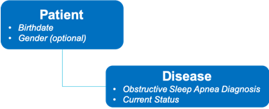
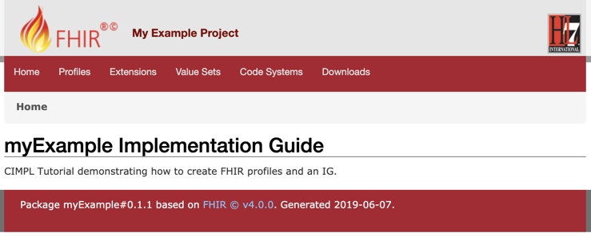
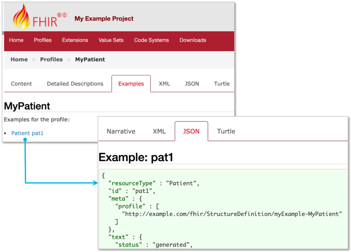

# CIMPL 6.0 In-depth Tutorial
_This is an extensive tutorial, meant to educate people about many different aspects of CIMPL.  If you're looking for a quick introduction to CIMPL and SHR-CLI environment setup, try the [Hello World](cimpl6Tutorial_helloWorld.md).  If you're looking for detailed guidance on CIMPL syntax, try the [CIMPL6 Language Reference documentation](cimpl6LanguageReference.md)._

***

**Table Of Contents**

[TOC]

***

# Pre-requisite

This tutorial assumes that you already have the following software components installed:

* [CIMPL SHR-CLI](cimplInstall.md) (preferably installed in the `~/cimpl/shr-cli` directory)
* A text-editor (preferably VSCode with the _vs-code-language-cimpl_ extension, but not required)

>**Note:** _This tutorial was run using a MacOS environment.  While the content of CIMPL authoring are identical regardless of platform, the command lines run in a command line terminal will differ in file path specifications.  Namely, for a Windows command line terminal, replace all the path references of forward-slash `/` to back-slash `\`._


## Tutorial Pre-configuration

To keep this tutorial more focused on how to model, we're first going to setup the environment with some supporting configuration and core data type files.

We're also going to assume the following directory structure for your configuration:

```
Directory:  cimpl
            |_ shr-cli
```

>**Note:** _Your top level directory where SHR-CLI was installed might differ. If so, then you'll be instead referencing the relative directory where you have installed shr-cli._

Create a sub-directory under `cimpl` called **`myExampleC6`**
Now your directory structure should look like this:

```
Directory:  cimpl
            |_ shr-cli
            |_ myExampleC6
```

Copy the following files to the `myExampleC6` sub-directory.  The files contain global definitions for Code Systems, Value Sets, maps to FHIR R4 elements and examples. These file names are hyperlinked for retrieval:

* [shr_core_datatype.txt](./cimplTutorial/shr_core_datatype.txt)
* [shr_core_datatype_vs.txt](./cimplTutorial/shr_core_datatype_vs.txt)
* [shr_core_datatype_map_r4.txt](./cimplTutorial/shr_core_datatype_map_r4.txt)
* [ig-myExampleR4-config.json](./cimplTutorial/ig-myExampleR4-config.json)

# Introduction

This tutorial will guide the user in a step by step process to build a basic clinical data model using the _"Clean Slate"_ method of CIMPL authoring. It will also illustrate the modeling practice briefly described in Appendix A of the [CIMPL Authoring Guide](cimpl6Authoring.md).

The steps are briefly summarized here for conciseness:

* Define use case(s)
* Create a high-level conceptual model
* Create a data element requirement list
* Create the logical model
* Create logical element-to-FHIR mappings
* Generate the FHIR Implementation Guide
* Create FHIR examples for each profile (optional)

## Define Use Cases

For our example, we'll focus on [obstructive sleep apnea (OSA)](https://www.webmd.com/sleep-disorders/guide/understanding-obstructive-sleep-apnea-syndrome#1). The goal is to measure the prevalence of patients diagnosed with OSA, stratified by age groups. A secondary goal is to further identify the population by gender. Electronic Health Records (EHRs) are the primary source for this information.

## Create a High-level Conceptual Model

A conceptual diagram is shown in the figure below:



While this case is very simple, diagrams of this sort are valuable to the non-technical community, and to drive further design of the model.

## Create a List of Data Elements

Creating a list of data elements helps to refine the contents, data types, cardinality, and clinical terminologies needed in the model. It helps at this stage to research existing standards and related models, but for this example, we won't look beyond FHIR resources for inspiration.

The table below is a high level summary of the elements we need in this use case:

| Entity | Data Element Name | Cardinality | Data type | Value Set (if applicable) |
|-------|-------|-------|-------|-------|
| Patient | BirthDate | 1..1 | date | |
| Patient | Gender | 0..1 | concept | HL7 Gender |
| OSADisorder | OSADisorderCode | concept | SNOMED codes for OSA |
| OSADisorder | OSADisorderStatus | concept | HL7 status codes |

## Create the Logical Model in CIMPL

Now we can start authoring models in the CIMPL development environment.

In this example, we are using the "clean slate" method of defining our logical model elements without using the pre-existing "Objective FHIR" class library.

CIMPL has three main files involved in the creation of a logical model - one of each for every CIMPL project. We list them here for brevity, but reference the CIMPL 6 Reference Guide for further details on each:

* Class file
* Value Set file
* Map file

The class file is the place to start. Create a new file under the `myExampleC6` subdirectory called **`myExample.txt`**.

Type in the CIMPL header information designating the namespace and version of the DataElement parser:

```
Grammar:        DataElement 6.0
Namespace:      myExample
Description:    "CIMPL Tutorial: myExample for an OSA patient."
Uses:           shr.core
```

Where:

* `Grammar` is a required keyword indicating the parser to be used, in this case _DataElement 6.0_
* `Namespace`, also required, is a short name for your project, implementation guide, or module you are defining.
* `Uses` is the list of all namespaces which your model elements will reference.  For our example, we fix this to _shr.core_.

Next, we will create our first profile called **`MyPatient`** which we determined will also have the following properties:

* `MyBirthDate` (a required field which only accepts one value)
* `MyGender` (an optional field that we want to have the receive accept if it so happens to have a value sent in any FHIR instance.)

Let's build our Patient logical model. Add the following lines below your CIMPL header.

```
Entry:         MyPatient
Description:   "An individual awaiting or under medical care and treatment. (source: Webster's Dictionary)"
Property:      MyBirthDate 1..1
Property:      MyGender 0..1

Element:       MyBirthDate
Description:   "The date when the patient was born."
Value:         date

Element:       MyGender
Description:   "Either of the two sexes (male and female), especially when considered with reference to social and cultural differences rather than biological ones. (source: Oxford Dictionary)"
Value:         concept from http://hl7.org/fhir/ValueSet/administrative-gender
```

What we just represented here is that there is a `Patient` entity called `MyPatient` which has 2 properties: `MyBirthdate` and `MyGender`. Never mind that FHIR Patient has these attributes -- this won't always be the case.

We determined from our clinical requirements that `MyBirthDate` has a data type of _date_, which is one of the primitive data types supported in CIMPL.

We also determined that `MyGender` is a value set that can be _male_, _female_, or _unknown_.  For the sake of simplicity, we find that HL7 has a matching value set identical to our requirements so we'll use that one for its value.

Now let's work on the OSA Disorder entity. Add the following text into the file:

```
Entry:        ObstructiveSleepApneaDisorder
Description:  "Obstructive sleep apnea (OSA) is a sleep-related breathing disorder that involves a decrease or complete halt in airflow despite an ongoing effort to breathe. It occurs when the muscles relax during sleep, causing soft tissue in the back of the throat to collapse and block the upper airway. (source: American Academy of Sleep Medicine)"
Property:     OSADisorderCode 1..1
Property:     OSACurrentStatus 0..1

Element:      OSADisorderCode
Description:  "The diagnosis or problem list code assigned to the OSA disorder."
Value:        concept from OSADisorderVS

Element:      OSACurrentStatus
Description:  "State of the diagnosis or problem list item."
Value:        concept from OSACurrentStatusVS
```

Here we specify the entity called `ObstructiveSleepApneaDisorder` containing two properties to define the disorder code and current status.  Both properties have been defined as concepts which  reference value sets that need to be defined. Again, don't be concerned that this seems to replicate the elements of FHIR Condition; many logical models will have elements with no analogy in FHIR.

### Creating Custom Value Sets

Create a new file called **`myExample_vs.txt`** underneath the `myExampleC6` directory.

Add the CIMPL value set header information below:

```
Grammar:    ValueSet 5.1
Namespace:  myExample
```

Where:

* `Grammar` is the keyword which specifies that the file created is a value set file conforming to CIMPL value set parser version 5.1.
* `Namespace` is the keyword whose value contains the namespace defined for your model.  In this case, it's `myExample`.

Next we specify the terms in the value set which we've defined in our clinical data requirements. Add the following text below the CIMPL value set header information:

```
CodeSystem:     SCT = http://snomed.info/sct
CodeSystem:     STAT = http://terminology.hl7.org/CodeSystem/condition-clinical

ValueSet:       OSADisorderVS
Description:    "The list of disorders related to Obstructive Sleep Apnea."
SCT#1101000119103   "Obstructive sleep apnea of adult (disorder)"
SCT#1091000119108   "Obstructive sleep apnea of child (disorder)"

ValueSet:       OSACurrentStatusVS
Description:    "The current disease status of an OSA patient"
STAT#active     "Active"
STAT#inactive   "Inactive"
STAT#resolved   "Resolved"
```

Here we have defined the terminology coding system reference by the value set, specified using the `CodeSystem:` keyword up front.  This allows us to tag a short-hand notation of the coding system to the code for each term in the value set.  It also allows for the flexibility of specifying terms with different coding systems within a value set, if applicable.

The format for specifying each term in the value set is as follows:
`<CodeSystem Abbreviation>#<Term Code>`

For example: `HL7CONDSTAT#active      "Active"` Where:

* HL7CONDSTAT is the value assigned to `CodeSystem:` which contains the canonical URL or urn: of the coding system.
* `#` is a delimiter separating the coding system and the code
* _`active`_ is the term code for the concept
* `"Active"` is the display name associated with the term code.

## Create Logical Model to FHIR mappings

Create a file called **`myExample_map_r4.txt`** under the `myExampleC6` sub-directory.

Copy the following header information to the top of the file:

```
Grammar:	Map 5.1
Namespace:	myExample
Target:		FHIR_R4
```
Where:

* `Grammar:` is the version supported for the mapping grammar
* `Namespace:` is the name of the namespace for your logical model
* `Target:` is the FHIR release version targeted for mapping elements in your logical model, one of the following values: FHIR_DSTU2, FHIR_STU_3, or FHIR_R4. Our mapping will be to FHIR_R4. 
Specifying the target also configures the CIMPL tool chain to generate R4 structure definitions.

During mapping, we ask the following questions:

* Is there a FHIR resource that could be a good fit for our logical model entities?
* If yes, is there an equivalent FHIR attribute for each of the properties in our logical model?
* If there is an equivalent FHIR attribute then do the data types, cardinality constraints, and terminology bindings align?

For simplicity, we made the example such that the answer is yes to all questions.  `MyPatient` entity can map to **[Patient](https://www.hl7.org/fhir/patient.html)**, and `ObstructiveSleepApneaDisorder` can map to **[Condition](https://www.hl7.org/fhir/condition.html)**. Because we have specified our target map to be _`FHIR_R4`_, our mappings will target the R4 version.

```
MyPatient maps to Patient:
    MyBirthDate maps to birthDate
    MyGender maps to gender

ObstructiveSleepApneaDisorder maps to Condition:
    OSADisorderCode maps to code
    OSACurrentStatus maps to clinicalStatus
```

The logical model properties also match to equivalent FHIR attributes for each resource we've chosen to build our profiles. And because FHIR profiling does allow to further constrain and not loosen cardinality constraints and binding strengths, we can confirm that our elements also satisfy those requirements.

## Generate the FHIR IG

In this section, we cover some of the extra CIMPL configuration steps that might be needed to customize the output of your FHIR IG.

### Specify the FHIR "Must-Support" elements

The CIMPL toolchain provides a separate configuration file called a "Content Profile" which serves two purposes:

* Specifies which elements in your logical model that you want to designate in FHIR as **["must-support" (MS)](https://www.hl7.org/fhir/conformance-rules.html#mustSupport)**.
* Instructs the CIMPL toolchain which elements you want auto-generated in a data dictionary output.

Together with specified cardinality, the MS declaration can be [interpreted as follows](http://wiki.hl7.org/index.php?title=Conformance_Implementation_Manual):

| Cardinality |  Must Support  | Interpretation |
|------------|------------|-------------|
| 1..1 |  any | required | 
| 0..1 | yes | required if known |
| 0..1 | no  | optional |

Create a file called **`ig-myExample-cp.txt`** under the `myExampleC6` sub-directory. Paste the following code snippet into your file:

```
Grammar:   ContentProfile 1.0
Namespace: myExample

MyPatient:
    MyGender MS

ObstructiveSleepApneaDisorder:
    OSADisorderCode MS

```

For our example, we have designated the `MyGender` and `OSADisorderCode` elements as _must-support_. Further documentation about the CIMPL Content Profile configuration can be found **[here](https://github.com/standardhealth/shr-cli#content-profile)**.

### Create a Homepage for the IG

Create a new file called **`index.html`** under the `myExampleC6` directory. Copy the following contents in this page:

```
<h1>myExample Implementation Guide</h1>
<p>CIMPL Tutorial demonstrating how to create FHIR profiles and an IG.</p>
```

### Configuring your output

For purpose of the tutorial's focus on modeling, we have already created a configuration file called `ig-myExampleR4-config.json` for our example and had you copy this file to the `myExampleC6` directory at the start of this tutorial.

But let's review some highlights of this file.  Click **[here](./cimplTutorial/ig-myExampleR4-config.json)** to view the contents of `ig-myExampleR4-config.json`. The table below shows a partial listing of fields in the config file. More advanced configuration options are available **[here](https://github.com/standardhealth/shr-cli#implementation-guide-configuration)**.

| Parameter | Value | Meaning |
|-------|-------|-------|
| `ProjectName` | "My Example Project" | This will appear on the home page title of your generated IG. |
| `fhirURL` | "http://example.com/fhir" | The URL  pre-pended to your StructureDefinition canonical URLs. |
| `contentProfile` | "ig-myExample-cp.txt" | The name of the file which sets FHIR _must-support_ flags. |
| `filterStrategy` | "true" | Indicates that not all entries in the logical model should be including in the IG |
| `strategy` | "namespace" | Indicates all logical model elements in the namespace will be in the IG. |
| `target` | ["myExample"] | JSON array containing the namespace(s) targeted by the filtering strategy. |
| `indexContent` | "index.html" | The file containing the IG homepage. |


### Running scripts to compile CIMPL and IG Generation


Generating the FHIR IG is a 2-step process:

Before executing Step 1 to compile your CIMPL code, an `examples` directory must exist. It can be empty.  

Create a subdirectory called **`examples_myFhirExamplesFolder`** under the `myExampleC6` folder.

**Step 1:**  Run the Command Line Interface (SHR-CLI) compiler.

* Open a command line terminal and navigate to the ./cimpl/shr-cli directory (or whichever directory you installed SHR-CLI).

* Run the following command:

    `node . ../myExampleC6 -l error -o myExampleC6r4 -c ig-myExampleR4-config.json`

Where:
* the first parameter after the node command, `../myExampleC6` is the path where your CIMPL modeling and configuration files are located.
* the `-l` parameter and _`error`_ value specifies logging to only show errors.
* the `-o` parameter and _`myExampleC6r4`_ value specify the name of the directory in which you want to generate the IG output.
* the `-c` parameter and _`ig-myExampleR4-config.json`_ value specify the name of the CIMPL configuration file to reference for the output.

After you run this first command, as an interim check, navigate to the `~/cimpl/shr-cli` folder.  You should see a new subdirectory created called `myExampleC6r4` which will eventually contain the StructureDefinition and html output of the generated IG. This is the value that was specified in the `-o` parameter in the above command.

**Step 2:**  Run the IG Publisher.

* From the same command line terminal, run the following command:

    `yarn run ig:publish`

* Alternately, run the full command to specify the destination directory (following the `-ig` flag):

    `java $JAVA_OPTS -jar myExampleC6r4/fhir/guide/org.hl7.fhir.publisher.jar -ig myExampleC6r4/fhir/guide/ig.json`

Navigate to the `~/cimpl/shr-cli/myExampleC6r4/fhir/guide/output` directory and open the **`index.html`** file in a browser.  This will display the home page of the generated FHIR IG for your example project.



## Create FHIR examples

We're now going to add a FHIR example that conforms to our profile. This step adds an example file to the directory you created in the first step. Since the details creating FHIR examples are out of scope for this tutorial, we're going to supply one for you.


```
Directory:  cimpl
            |_ shr-cli
            |_ myExampleC6
               |_ examples_myFhirExamplesFolder
```

Copy the file [myPatientExample1.json](./cimplTutorial/myPatientExample1.json) and its contents into the `examples_myFhirExamplesFolder`.

>**Note:** _The FHIR example can contain additional content, and still pass validation. What matters is that the requirements of the profile are met._

Add the following line to your cimpl configuration file within the `"implementationGuide":` JSON object:

**`        "examples": "examples_myFhirExamplesFolder"`**

We have already added it for you so you can just check that the parameter is there.

The following screenshot shows an exmample of where you would find this parameter within the CIMPL configuration file `ig-myExampleR4-config.json`.


Now run SHR-CLI and the IG publisher commands again:

`node . ../myExampleC6 -l error -o myExampleC6r4 -c ig-myExampleR4-config.json`

`java $JAVA_OPTS -jar myExampleC6r4/fhir/guide/org.hl7.fhir.publisher.jar -ig myExampleC6r4/fhir/guide/ig.json`

Open the index.html file from the generated IG output in your browser and navigate to the **Profiles** tab and select the MyPatient profile.

You'll now find a tab called `Examples` which will contain a URL to the example within the `examples_myFhirExamplesFolder`.



So you might be thinking, "How does the IG know which profile to insert your example?"

The answer is that the name of the related FHIR StructureDefinition for the profile is specified within the FHIR example itself...


The IG Publisher will match the canonical URL specified in the example with what is specified in the IG. Note that the value of the profile parameter must match the canonical URL of the profile where the StructureDefinition is located in order for the example to appear.
