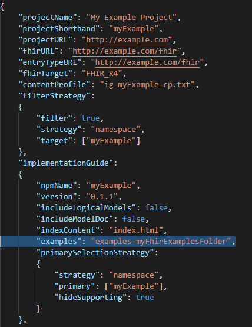

# CIMPL In-Depth Tutorial

## Preface

CIMPL (**C**linical **I**nformation **M**odeling **P**rofiling **L**anguage) is a specially-designed language for defining clinical information models. It is simple and compact, with tools to produce [Fast Healthcare Interoperability Resources (FHIR)](https://www.hl7.org/fhir/overview.html) profiles, extensions and implementation guides (IG). Because it is a _language_, written in text statements, CIMPL encourages distributed, team-based development using conventional source code control tools such as Github. CIMPL provides tooling that enables you to define a model once, and publish that model to multiple versions of FHIR.

### Purpose

This is an extensive tutorial, meant to expose the reader to many aspects of CIMPL and its tooling (SHR-CLI).  

### Intended Audience

The CIMPL In-Depth Tutorial is targeted to any person who wants to create a FHIR IG, wants to learn how to leverage CIMPL to accomplish that goal, and is comfortable with programming languages. Familiarity with FHIR is helpful as the tutorial references FHIR artifacts (such as Resources, Elements, etc.).

### Prerequisite

This guide assumes you have:

* Installed the latest version of the SHR-CLI software as documented in [CIMPL Setup and Installation](cimplInstall.md) (preferably installed in the `~/cimpl/shr-cli` directory)
* A text editor to edit you CIMPL files (preferably VSCode with the _vs-code-language-cimpl_ extension, but not required)
* Reviewed the [Hello World Tutorial](cimpl6Tutorial_helloWorld.md).

***

## Table of Contents

[TOC]

***

## Initial Setup

This tutorial is focused on how to create a model that will be used as input to a FHIR IG. Supporting configuration and core data type files have been defined for you.

The following directory structure is assumed:

```
Directory:  cimpl
            |_ shr-cli
```

>**Note:** _Your top level directory where SHR-CLI was installed might differ. If so, then you'll be instead referencing the relative directory where you have installed shr-cli._

Create a sub-directory under `cimpl` called **`myExampleC6`**
Now your directory structure should look like this:

```
Directory:  cimpl
            |_ shr-cli
            |_ myExampleC6
```

Copy the following files to the `myExampleC6` sub-directory.  The files contain global definitions for Code Systems, Value Sets, maps to FHIR R4 elements and examples. These file names are hyperlinked for retrieval:

| File    | Purpose                 |
|---------|-------------------------|
| [obf-datatype.txt](./cimplTutorial/obf-datatype.txt) | Complex data type definitions |
| [obf-datatype-vs.txt](./cimplTutorial/obf-datatype-vs.txt) | Value sets supporting the data types |
|  [obf-datatype-map-r4.txt](./cimplTutorial/obf-datatype-map-r4.txt) | Mapping between [CIMPL data types](#Primitives), complex data types and [FHIR 4.0 data types](https://www.hl7.org/fhir/datatypes.html) |
| [ig-myExampleR4-config.json](./cimplTutorial/ig-myExampleR4-config.json) | Configuration settings supporting IG creation|

## Modeling Process

This tutorial guides you in a step by step process to build a basic clinical data model that directly references FHIR resources. It also illustrates the modeling practice briefly described in the [CIMPL Authoring Guide](cimpl6Authoring.md).

The steps are briefly summarized here:

* Define use case(s)
* Create a high-level conceptual model
* Create a data element requirement list
* Create the logical model
* Create logical element-to-FHIR mappings
* Generate the FHIR IG
* Create FHIR examples for each profile (optional)

### Define Use Cases

For our example, we'll focus on [obstructive sleep apnea (OSA)](https://www.webmd.com/sleep-disorders/guide/understanding-obstructive-sleep-apnea-syndrome#1). The goal is to measure the prevalence of patients diagnosed with OSA, stratified by age groups. A secondary goal is to further identify the population by gender. Electronic Health Records (EHRs) are the primary source for this information.

### Create a High-level Conceptual Model

A conceptual diagram is shown in the figure below:


Diagrams of this sort may be valuable to the community reviewing and using the IG, especially when the model is complex, and can serve as a basis to drive further design of the model.

### Create a List of Data Elements

Creating a list of data elements helps to refine the contents, data types, cardinality, and clinical terminologies needed in the model. It helps at this stage to research existing standards and related models, but for this example, we won't look beyond FHIR resources for inspiration.

The table below is a high level summary of the elements we need in this use case:

| Entity | Data Element Name | Cardinality | Data type | Value Set (if applicable) |
|-------|-------|-------|-------|-------|
| Patient | BirthDate | 1..1 | date | |
| Patient | Gender | 0..1 | concept | HL7 Administrative Gender |
| OSADisorder | OSADisorderCode | 1..1 | concept | SNOMED codes for OSA |
| OSADisorder | OSADisorderStatus | 0..1 | concept | HL7 status codes |

[CIMPL's `concept` data type](cimpl6LanguageReference.md#Concept-Codes) encompasses any enumerated or terminology-coded data types. FHIR's CodeableConcept, Coding, and code are all `concept` in CIMPL.

### Create the Logical Model in CIMPL

In this example, the only part of the [CIMPL Class Library](cimpl6ObjectiveFHIR.md) we are using is the datatypes.

CIMPL has three main files involved in the creation of a logical model - one of each for every CIMPL project. We list them here for brevity, but reference the [CIMPL 6 Language Reference Guide](cimpl6LanguageReference.md) for further details on each:

* Class file
* Value Set file
* Map file

The class file is the place to start. Create a new file under the `myExampleC6` subdirectory called **`myExample.txt`**.

Type in the CIMPL header information designating the namespace and version of the DataElement parser:

```
Grammar:        DataElement 6.0
Namespace:      myExample
Description:    "CIMPL Tutorial: myExample for an OSA patient."
Uses:           obf.datatype
```

Where:

* `Grammar` is a required keyword indicating the parser to be used, in this case _DataElement 6.0_
* `Namespace`, also required, is a short name for your project, IG, or module you are defining. This should be a meaningful and easily recognizable name.
* `Uses` is the list of all namespaces which your model elements will reference.  For our example, we set this to _obf.datatype_.

Next, we will create our first class, called **`MyPatient`**, which we determined will also have the following properties:

* `MyBirthDate` (a required field which only accepts one value)
* `MyGender` (an optional field that we want to have the receiver accept, if the value is known.)

Let's build our Patient logical model. Add the following lines below your CIMPL header:

```
Entry:         MyPatient
Description:   "An individual awaiting or under medical care and treatment. (source: Webster's Dictionary)"
Property:      MyBirthDate 1..1
Property:      MyGender 0..1

Element:       MyBirthDate
Description:   "The date when the patient was born."
Value:         date

Element:       MyGender
Description:   "Either of the two sexes (male and female), especially when considered with reference to social and cultural differences rather than biological ones. (source: Oxford Dictionary)"
Value:         concept from http://hl7.org/fhir/ValueSet/administrative-gender
```

We now have a `Patient` entity called `MyPatient` which has 2 properties: `MyBirthdate` and `MyGender`. The FHIR Patient base resource has these attributes; for purposes of this tutorial we will not consider that information -- this won't always be the case.

We determined from our clinical requirements that `MyBirthDate` has a data type of _date_, which is one of the primitive data types supported in CIMPL. This data type is  expressed with the _Value_ keyword.

We also determined that `MyGender` has a data type of _concept_ which allows us to constrain the allowable values to a value set containing: _male_, _female_, and _unknown_.  We find that HL7 has a matching value set identical to our requirements so we'll use that one for its value.

Now let's work on the OSA Disorder entity. Add the following text into the file:

```
Entry:        ObstructiveSleepApneaDisorder
Description:  "Obstructive sleep apnea (OSA) is a sleep-related breathing disorder that involves a decrease or complete halt in airflow despite an ongoing effort to breathe. It occurs when the muscles relax during sleep, causing soft tissue in the back of the throat to collapse and block the upper airway. (source: American Academy of Sleep Medicine)"
Property:     OSADisorderCode 1..1
Property:     OSACurrentStatus 0..1

Element:      OSADisorderCode
Description:  "The diagnosis or problem list code assigned to the OSA disorder."
Value:        concept from OSADisorderVS

Element:      OSACurrentStatus
Description:  "State of the diagnosis or problem list item."
Value:        concept from OSACurrentStatusVS
```

The entity named `ObstructiveSleepApneaDisorder` contains two properties to define the disorder code and current status. Both properties have been defined as elements with a data type of _concept_ and reference value sets that need to be defined. If you are familiar with the FHIR Condition resource you will notice that the elements in your model replicate two Condition elements. At a later point in this tutorial, the elements will be mapped to FHIR resource elements.

### Create Custom Value Sets

We need to define the value sets, OSADisorderVS and OSACurrentStatusVS.

Create a new file called **`myExample-vs.txt`** underneath the `myExampleC6` directory, and add the CIMPL value set header information below:

```
Grammar:    ValueSet 5.1
Namespace:  myExample
```

Where:

* `Grammar` is the keyword which specifies that the file created is a value set file conforming to CIMPL value set parser version 5.1.
* `Namespace` is the keyword whose value contains the namespace defined for your model.  In this case, it's `myExample`.

Next we specify the concepts in the value sets, as defined in our clinical data requirements. Add the following text below the CIMPL value set header information:

```
CodeSystem:     SCT = http://snomed.info/sct
CodeSystem:     STAT = http://terminology.hl7.org/CodeSystem/condition-clinical

ValueSet:       OSADisorderVS
Description:    "The list of disorders related to Obstructive Sleep Apnea."
SCT#1101000119103   "Obstructive sleep apnea of adult (disorder)"
SCT#1091000119108   "Obstructive sleep apnea of child (disorder)"

ValueSet:       OSACurrentStatusVS
Description:    "The current disease status of an OSA patient"
STAT#active     "Active"
STAT#inactive   "Inactive"
STAT#resolved   "Resolved"
```

The `CodeSystem` keyword defines the code systems (e.g. SNOMED-CT, ICD-10, etc.) the concepts in value sets are drawn from. The code systems are referred to by URLs. To learn more about code systems and the relationship to value sets, see https://www.hl7.org/fhir/codesystem.html.

The format for specifying each concept in the value set is as follows:
`<CodeSystem Alias>#<Code> "<Display>"`, for example: `"STAT"#active "Active"` where:

* `"STAT"` is an alias that represents the http://terminology.hl7.org/CodeSystem/condition-clinical code system, assigned in the `CodeSystem` statement
* `#` is a delimiter separating the code system and the code
* `active` is the code for the concept
* `"Active"` is the display name associated with the concept.

The display name _must_ follow rules as defined by the code system steward. For example, as documented in [Using SNOMED-CT with FHIR](https://www.hl7.org/fhir/snomedct.html), the best display is the preferred term in the relevant language or dialect, as specified in the associated language reference set.

_**Note:** Code system aliases are required. Direct use of a URL or urn (e.g., `http://terminology.hl7.org/CodeSystem/condition-clinical#active`) is NOT supported in CIMPL._


### Create Logical Model to FHIR mappings

Create a file called `myExample-map-r4.txt` under the `myExampleC6` sub-directory, and copy the following header information to the top of the file:

```
Grammar:    Map 5.1
Namespace:  myExample
Target:     FHIR_R4
```

Where:

* `Grammar` is the version supported for the mapping grammar
* `Namespace` is the name of the namespace for your logical model (same as used before)
* `Target` is the FHIR release version targeted for mapping elements in your logical model, one of the following values: FHIR_DSTU2, FHIR_STU_3, or FHIR_R4. Our mapping will be to FHIR_R4. Specifying the target also configures the CIMPL tool chain to generate R4 structure definitions.

While mapping, we ask the following questions:

* Is there a FHIR resource that is a good fit for our logical model entities?
* If yes, is there an equivalent FHIR attribute or extension for each of the properties in our logical model?
* If there is an equivalent FHIR attribute then do the data types, cardinality constraints, and terminology bindings align?

For simplicity, we made the example such that the answer is yes to all questions. `MyPatient` entity can map to the [Patient](https://www.hl7.org/fhir/patient.html) resource, and `ObstructiveSleepApneaDisorder` can map to the [Condition](https://www.hl7.org/fhir/condition.html) resource. Because we have specified our target map to be _`FHIR_R4`_, our mappings target the R4 version.

Add the following statements to your map file:

```
MyPatient maps to Patient:
    MyBirthDate maps to birthDate
    MyGender maps to gender

ObstructiveSleepApneaDisorder maps to Condition:
    OSADisorderCode maps to code
    OSACurrentStatus maps to clinicalStatus
```

The logical model properties (defined in the Class file) also match to equivalent FHIR attributes for each resource we've chosen to build our profiles. Because FHIR profiling allows further constraining and not loosening cardinality constraints and binding strengths, we can confirm that our elements also satisfy those requirements.

## Generate the FHIR IG

In this section, we cover some of the extra CIMPL configuration steps that might be needed to customize the output of your FHIR IG.

### Specify FHIR _mustSupport_ Elements

The CIMPL toolchain provides a separate configuration file called a _Content Profile_ that allows you to define IG specific parameters. This tutorial uses the _mustSupport_ feature that specifies elements in your logical model as **[_mustSupport_ (`MS`)](https://www.hl7.org/fhir/conformance-rules.html#mustSupport)** in FHIR.

Together with specified cardinality, the _MS_ declaration can be [interpreted as follows](http://wiki.hl7.org/index.php?title=Conformance_Implementation_Manual):

| Cardinality |  Must Support  | Interpretation |
|------------|------------|-------------|
| 1..1 |  any | required |
| 0..1 | yes | required if known |
| 0..1 | no  | optional |

Create a file called **`ig-myExample-cp.txt`** under the `myExampleC6` sub-directory. Paste the following code snippet into your file:

```
Grammar:   ContentProfile 1.0
Namespace: myExample

MyPatient:
    MyGender MS

ObstructiveSleepApneaDisorder:
    OSADisorderCode MS
```

For our example, we have designated the `MyGender` and `OSADisorderCode` elements as _mustSupport_.  

More information about Content Profile settings is provided in the [CIMPL Tooling Reference Guide](cimpl6ToolingReference.md).

_**Note:** `MS` renders as an `S` in a red box in FHIR._

### Create a Homepage for the IG

Create a new file called `index.html` under the `myExampleC6` directory. Copy the following contents in this page:

```
<h1>myExample Implementation Guide</h1>
<p>CIMPL Tutorial demonstrating how to create FHIR profiles and an IG.</p>
```

### Configure the Output

For purpose of the tutorial's focus on modeling, we have already created a configuration file called `ig-myExampleR4-config.json` and you copied this file to the `myExampleC6` directory at the start of this tutorial.

Let's review some highlights of [the configuration file](cimplTutorial/ig-myExampleR4-config.json) (click link to open). The table below shows a partial listing of fields in the config file. More advanced configuration options are available in the [CIMPL Tooling Reference Guide](cimpl6ToolingReference.md).


| Parameter | Value | Meaning |
|-------|-------|-------|
| `ProjectName` | "My Example Project" | This will appear on the home page title of your generated IG. |
| `fhirURL` | "http://example.com/fhir" | The URL  pre-pended to your StructureDefinition canonical URLs. |
| `contentProfile` | "ig-myExample-cp.txt" | The name of the file which sets FHIR _must-support_ flags. |
| `filterStrategy` | "true" | Indicates that not all _Entries_ in the logical model should be included in the IG. |
| `target` | ["myExample"] | JSON array containing the namespace(s) targeted by the filtering strategy. |
| `indexContent` | "index.html" | The file containing the IG homepage. |

### Compile CIMPL

To create profiles, extensions, and other FHIR assets used in the IG, run the SHR-CLI tool.

* Open a command line terminal and navigate to the ~/cimpl/shr-cli directory (where you installed SHR-CLI)
* Run the following command:

    `node . ../myExampleC6 -l error -o myExampleC6r4 -c ig-myExampleR4-config.json`

Where:

* `node` is the command that starts the SHR-CLI application.
* The first dot `.` represents the path to the SHR-CLI tool, in this case, the current working directory. The dot represents the current directory.
* `../myExampleC6` is the path where your CIMPL modeling and configuration files are located. The double dot `..` represents the directory above the current working directory.
* the `-l` parameter and `error` value specifies logging to only show errors.
* the `-o` parameter and `myExampleC6r4` value specify the name of the directory where you want to generate the IG output.
* the `-c` parameter and `ig-myExampleR4-config.json` value specify the name of the CIMPL configuration file to reference for the output.

After you run this first command, as an interim check, navigate to the `~/cimpl/shr-cli` folder.  You should see a new subdirectory created called `myExampleC6r4` which will eventually contain the StructureDefinition and html output of the generated IG. This is the value that was specified in the `-o` parameter in the above command.

### Run the FHIR IG Publisher

* From the same command line terminal, run the following command:

    `yarn run ig:publish`

* Alternately, run the full command to specify the destination directory (following the `-ig` flag):

    `java -jar myExampleC6r4/fhir/guide/org.hl7.fhir.publisher.jar -ig myExampleC6r4/fhir/guide/ig.json`

Navigate to the `~/cimpl/shr-cli/myExampleC6r4/fhir/guide/output` directory and open the `index.html` file in a browser.  This displays the home page of the generated FHIR IG for your example project.


### Add FHIR Examples

We're now going to add a FHIR example that conforms to our model. This step adds an example file to the directory you created in the first step. Since the details creating FHIR examples are out of scope for this tutorial, an example has been provided.

Create a subdirectory called **`examples-myFhirExamplesFolder`** under the `myExampleC6` folder.

```
Directory:  cimpl
            |_ shr-cli
            |_ myExampleC6
               |_ examples-myFhirExamplesFolder
```

Copy the file [myPatientExample1.json](cimplTutorial/myPatientExample1.json) and its contents into the `examples-myFhirExamplesFolder` you created in the [Compile CIMPL](#compile-cimpl) step.

>**Note:** _The FHIR example can contain content beyond the model, and still pass validation. What matters is that the requirements of the model are met._

Add the following line to your CIMPL configuration file within the `implementationGuide` JSON object:

`"examples": "examples-myFhirExamplesFolder"`

The following screenshot shows where to put this parameter within the CIMPL configuration file `ig-myExampleR4-config.json`:



### Compile CIMPL and Run the FHIR IG publisher

Because you changed the contents of your model to add an example, you need to recompile, and regenerate the IG.

* CIMPL Compile (using SHR-CLI)

```
node . ../myExampleC6 -l error -o myExampleC6r4 -c ig-myExampleR4-config.json
yarn run ig:publish
```

Open the index.html file from the generated IG output in your browser and navigate to the **Profiles** tab and select the MyPatient profile.

You'll now find a tab called `Examples` which contains a URL to the example within the `examples-myFhirExamplesFolder`.


So you might be thinking, "How does the IG know which profile to add your example to?"

The answer is that the name of the related FHIR StructureDefinition for the profile is specified within the FHIR example itself:


The IG Publisher will match the canonical URL specified in the example, with what is specified in the IG. Note that the value of the profile parameter must match the canonical URL of the profile where the StructureDefinition is located in order for the example to appear.
