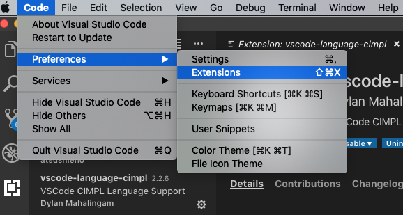

# CIMPL Authoring
_The purpose of this guide is to educate people about many different aspects of creating CIMPL models and its supporting utilities.  If you're looking for a quick introduction to CIMPL and `shr-cli` environment setup, try the [Hello World](cimpl6Tutorial_helloWorld.md).  If you're looking for detailed guidance on CIMPL syntax, try the [CIMPL6 Language Reference documentation](cimpl6LanguageReference.md)._

***

**Table Of Contents**

[TOC]

***
# Authoring Environment

Any text editor can be used to write CIMPL grammar. However, [VSCode editor](https://code.visualstudio.com/) is recommended to take advantage of custom-developed to better navigate CIMPL constructs.  

## Setting up the VSCode Authoring

>**Note:** VSCode UI screenshots in this section were taken from a MacOS environment. While the overall functionality is the same across supported OS platforms, installation and configuration specifics might differ. Reference the VSCode documentation pertinent to your OS platform.

* Download the [VSCode editor](https://code.visualstudio.com/). 
* Open VSCode and search for the extension **vscode-lang-cimpl**.  The figure below shows where to find VSCode extensions.



### Navigating a CIMPL Model within VSCode

Elements properties can be previewed in the following ways:

1. **Hovering over the element**: This provides a drop-down list of an element's property names and cardinality, if available.
2. **Placing the cursor on the element text and right-clicking option _Peek Definition_**: This will display a drop-down window with a preview of the definition. The name and location of the file will be displayed although the entire file will not be opened.
3. **Placing the cursor on the element text and right-clicking option _Go to Definition_**: This will redirect the author to location of the definition, opening the file for display if it's not in the same location where it is referenced.

<br />

Hovering over the element:


Using _Peek Definition_:


Using _Go to Definition_:


# Using CIMPL to Create FHIR-based Models

CIMPL is designed to be modular and extensible, allowing for the reuse of other logical models, and inheriting its properties. The figure below illustrates this notion.


The modeling author has multiple ways in CIMPL to represent  FHIR profiles:

* **Define all of the customized resource attributes you need from scratch (_"Clean slate"_)** - In this approach, the modeling author already knows which FHIR base resources they will be customize, and just define the element constraints or extensions in the FHIR profile.
* **Leverage CIMPL's "ObjectiveFHIR" (OBF) base FHIR models** -  In this approach, the modeling author will define their profile and specify a `Parent` class from the **ObjectiveFHIR** elements. Reference the [ObjectiveFHIR User Guide](cimpl6ObjectiveFHIR.md) for details.

Each profiling specification approach has advantages and disadvantages.

The CIMPL "clean slate" authoring approach might be beneficial when prototyping models containing only small number of profiles with minimal repetition of elements.  However, as the number of customizations increase, maintenance becomes more cumbersome and difficult to keep consistent between FHIR profiles.

On the other hand, using ObjectiveFHIR (OBF) base FHIR models has the significant benefits which include but are not limited to:

* saves the modeling author time in mapping common elements to its equivalent FHIR attribute.
* ensures consistency in the representation of commonly used attributes in different FHIR resources.

The user must however invest time to understand the ObjectiveFHIR logical model. Also, ObjectiveFHIR does not comprehensively support all FHIR resources, especially the new ones in R4 which have a low maturity level.

## Mapping to FHIR

Logical model elements are mapped to FHIR by creating and editing map files.
As a best practice, CIMPL map files must have the *_map.txt* naming convention.

Each map file should start with the following 3 lines:

* Grammar: Map _mapping_grammar_version_
* Namespace:  _data element group name_
* Target: _fhir target version_

Where:

* _mapping_grammar_version_ is the version number for parsing the contents of the map file. The current version is 5.1.
* _data element group name_ is the name of the grouping of elements that you have identified.
* _fhir target version_ is a choice of FHIR_DSTU_2, FHIR_STU_3, or FHIR_R4

The snippet below shows an example:
```
Grammar:	Map 5.1
Namespace:	shr.core
Target:		FHIR_R4
```

## Specifying FHIR "MustSupport" Elements

FHIR specifies a ["MustSupport"](https://www.hl7.org/fhir/conformance-rules.html#mustSupport) boolean flag which allows a profile to indicate that a reference implementation must be able to process the existence of particular element in a FHIR instance and display it if contents are available.

MustSupport is contextual and could vary depending on the reference implementation. CIMPL uses a separate file so that MustSupport elements are at the IG configuration level through a *Content Profile* file.

Content Profile files are text files which use the following convention:

```
ig-<Content Profile Name>-cp.txt
```

Where `<Content Profile Name>` is by convention the same name as the IG Configuration JSON file.

For example, the two file name examples of a CIMPL Configuration File and its respective Content Profile are show below:

* Configuration filename: `ig-myCIMPLConfiguration-config.json`
* Content Profile filename: `ig-myCIMPLConfiguration-cp.txt`

## Embedding FHIR Examples in the IG

Pre-requisite: the author has already created a FHIR example in JSON or XML format.

Configuring FHIR examples to appear in the generated IG involves the following steps:

* Create a folder which will contain your FHIR examples
* Modify the CIMPL configuration file to specify the folder containing your examples

The folder created can be any name, as long as it is specified within the CIMPL configuration file.

The folder location is specified using the `"examples:"` parameter in the CIMPL configuration file.  This is illustrated in the figure below:


## FHIR IG Publisher Output

The final step in the IG creation process is to run the **[FHIR IG Publisher](http://wiki.hl7.org/index.php?title=IG_Publisher_Documentation)**. This tool is maintained and owned by HL7 FHIR.

At a command prompt, use one of the 2 options:

* **Option 1 (_if the defaults were used in running shr-cli_):** yarn run ig: publish
* **Option 2 (_if not using defaults and specifying a directory in running shr-cli_):** java -Xms4g -Xmx8g -jar <_directory specified when running shr-cli_>/fhir/guide/org.hl7.fhir.publisher.jar -ig <_directory specified when running shr-cli_>/fhir/guide/ig.json

By default, the FHIR IG Publisher will perform validation checks on the  StructureDefinition of specified FHIR profiles, value sets, and examples which reference any base resources or FHIR profiles.  An output of these checks are found in the CIMPL output, *qa.html*.

An example QA output is shown in the figure below:


## Support

Questions on using CIMPL and its toolchain can be addressed on the HL7 Zulip chat channel [#cimpl](https://chat.fhir.org/#streams/197290/cimpl)

Report any issues on one of the following GitHub repositories:

* Related to modeling of CIMPL constructs or its FHIR-based classes: https://github.com/standardhealth/shr_spec/issues
* Related to running the CIMPL `shr-cli` compiler, CIMPL export configuration files, or generating the FHIR Implementation Guide (IG): https://github.com/standardhealth/shr-cli/issues

# Appendix A: An Approach to CIMPL Modeling for FHIR

Keeping in mind that CIMPL is primarily a way to create logical models with the capability to "model-once, translate-many", the modeling author should consider requirements-gathering and high level modeling steps.  While one approach is proposed below, the modeling author is not limited to following these steps and might find better approaches to creating detailed clinical models.

* Define the use cases behind the creation of a model.
* Create a high-level conceptual model which addresses your defined use case and can be easily understood by both technical and clinical communities.
* Create a data dictionary listing the data elements, cardinality, and potential value sets involved if the data type is a coded element. This provides a convenient summary for implmenters presented in a way that can be understood by non-technical subject matter experts involved in defining the use cases more than the model's design and implementation.
* Create the logical model in CIMPL which aligns with the high-level conceptual model and data elements noted in the previous steps.
* Create [FHIR mappings](#Mapping-to-FHIR) from the logical model to its equivalent FHIR resource and attributes, noting which elements you've defined in your logical model will be extensions.
* Generate the FHIR Implementation Guide.
* Create FHIR examples for each of the key profiles which define your IG and configure them within the CIMPL authoring environment so that they are validated by the FHIR IG Publisher.
