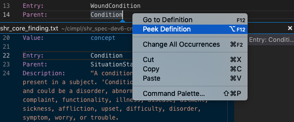
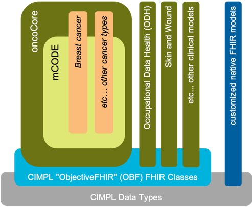
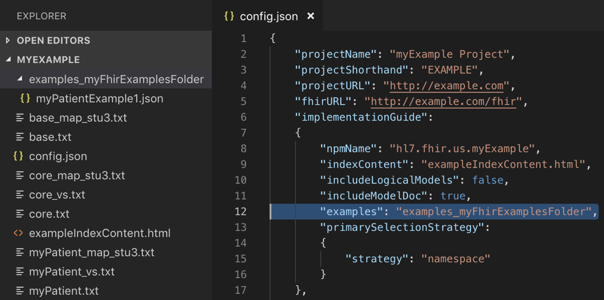

# CIMPL Authoring
_The purpose of this guide is to educate people about many different aspects of creating CIMPL models and its supporting utilities.  If you're looking for a quick introduction to CIMPL and `shr-cli` environment setup, try the [Hello World](cimpl6Tutorial_helloWorld.md).  If you're looking for detailed guidance on CIMPL syntax, try the [CIMPL6 Reference documentation](cimpl6Reference.md)._

***

**Table Of Contents**

[TOC]

***
# Authoring Environment

Any text editor can be used to write CIMPL grammar. However, [VSCode editor](https://code.visualstudio.com/) is recommended to take advantage of custom-developed to better navigate CIMPL constructs.  

## Setting up the VSCode Authoring

>**Note:** VSCode UI screenshots in this section were taken from a MacOS environment. While the overall functionality is the same across supported OS platforms, installation and configuration specifics might differ. Reference the VSCode documentation pertinent to your OS platform.

* Download the [VSCode editor](https://code.visualstudio.com/). 
* Open VSCode and search for the extension **vscode-lang-cimpl**.  The figure below shows where to find VSCode extensions.

### Navigating a CIMPL Model within VSCode

Elements properties can be previewed in the following ways:

1. hovering over the element.
2. placing the cursor on the element text and right-clicking option _Peek Definition_
3. placing the cursor on the element text and right-clicking option _Go to Definition_

 

Hovering over the element:

Using _Peek Definition_:

Using _Go to Definition_:

# Using CIMPL to create FHIR-based Models

With the environment now configured, we now turn our attention to how to create a clinical model.

CIMPL is designed to be modular and extensible, allowing for the reuse of other logical models, and inheriting its properties. The figure below illustrates this notion with some existing CIMPL-authored models.

## An Approach to CIMPL Modeling for FHIR

Keeping in mind that CIMPL is primarily a way to create logical models with the capability to "model-once, translate-many", it is advised that the modeler first consider several requirements-gathering and specification activities noted below as a best practice instead of immediately jumping into its representation in FHIR:

* define the use case behind the creation of a model.
* create a high-level conceptual model which addresses your defined use case and can be easily understood by both technical and clinical communities.
* list the data elements, cardinality, and potential value sets involved (if the data type is a coded element).
* create the logical model in CIMPL which aligns with the high-level conceptual model and data elements noted in the previous steps.
* create FHIR mappings from the logical model to its equivalent FHIR resource and attributes, noting which elements you've defined in your logical model will be extensions.
* generate the FHIR Implementation Guide.
* create FHIR examples for each of the key profiles which define your IG and configure them within the CIMPL authoring environment so that they are validated by the FHIR IG Publisher.

## Mapping to FHIR

Logical model elements are mapped to FHIR by creating and editing map files.
As a best practice, CIMPL map files must have the *_map.txt* naming convention.

Each map file should start with the following 3 lines:

Grammar:	Map 6.0
Namespace:  _data element group name_
Target:		_fhir target version_

Where:

* _namespace name_ is the name of the grouping of elements that you have identified.
* _fhir target version_ is a choice of FHIR_DSTU_2, FHIR_STU_3, or FHIR_R4

## Specifying FHIR "MustSupport" Elements

FHIR specifies a ["MustSupport"](https://www.hl7.org/fhir/conformance-rules.html#mustSupport) boolean flag which allows a profile to indicates that a reference implementation must be able to process the existence of particular element in a FHIR instance and display it if contents are available.

MustSupport is contextual and could vary with depending on the reference implementation. CIMPL subsequently created a separate file so that MustSupport of elements are at the IG configuration level through a *Content Profile* file.

Content profile files are text files which use the following convention:

    ig-<Content Profile Name>-cp.txt

Where `<Content Profile Name>` is by convention the same name as the IG Configuration JSON file.

For example, the two file name examples of a CIMPL configuration and its respective content profile are show below:

* Configuration filename: `ig-myCIMPLConfiguration-config.json`
* Content Profile filename: `ig-myCIMPLConfiguration-cp.txt`

## Embedding FHIR Examples in the IG

Pre-requisite: the author has already created a FHIR JSON or xml.
Configuring FHIR examples to appear in the generated IG involves the following steps:

* Create a folder which will contain your FHIR examples
* Modify the CIMPL configuration file to specify the folder containing your examples

The folder created can be any name, as long as it is specified within the CIMPL configuration file.

The folder location is specified using the `"examples:"` parameter in the CIMPL configuration file.  This is illustrated in the figure below:

## IG Publisher Output

By default, the FHIR IG Publisher will perform validation checks on the  StructureDefinition of specified FHIR profiles, value sets, and examples which reference any base resources or FHIR profiles.  An output of these checks are found in the CIMPL output, *qa.html*.

An example QA output is shown in the figure below:

# Support

Questions on using CIMPL and its toolchain can be addressed on the HL7 Zulip chat channel [#cimpl](https://chat.fhir.org/#streams/197290/cimpl)

Report any issues on one of the following GitHub repositories:

* Related to modeling of CIMPL constructs or its FHIR-based classes: https://github.com/standardhealth/shr_spec/issues
* Related to running the CIMPL `shr-cli` compiler, CIMPL export configuration files, or generating the FHIR Implementation Guide (IG): https://github.com/standardhealth/shr-cli/issues